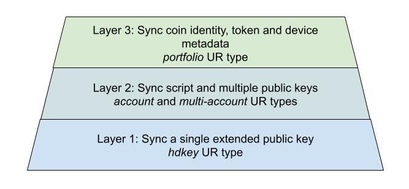
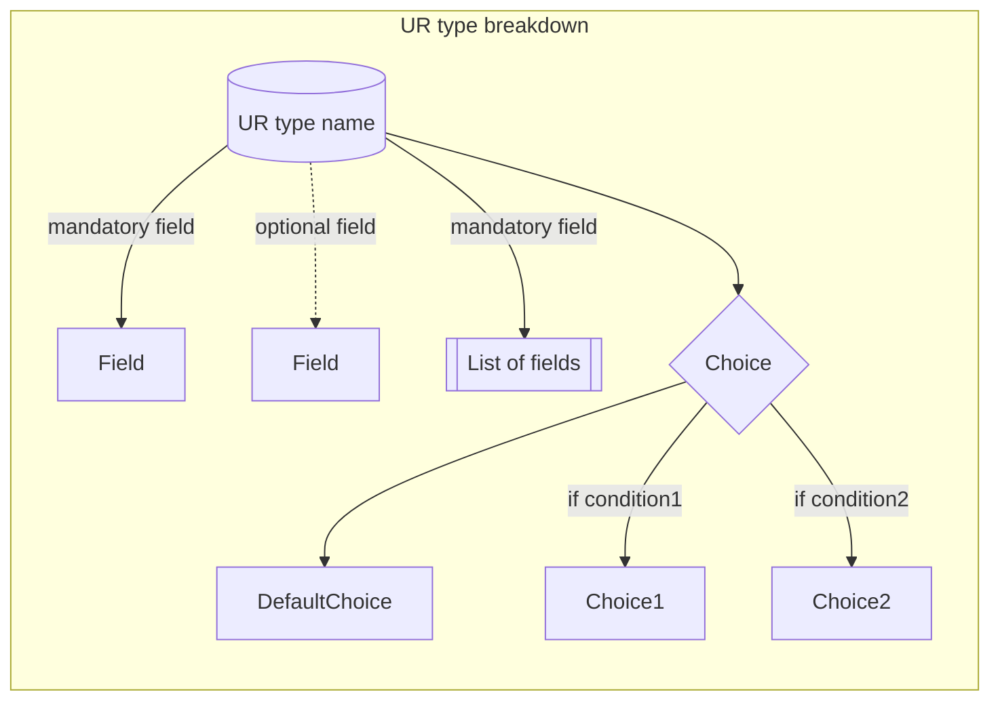
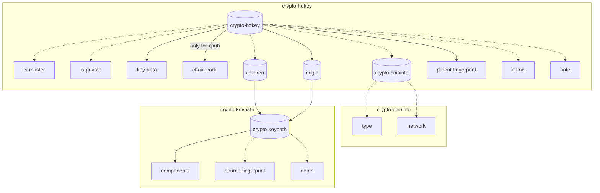
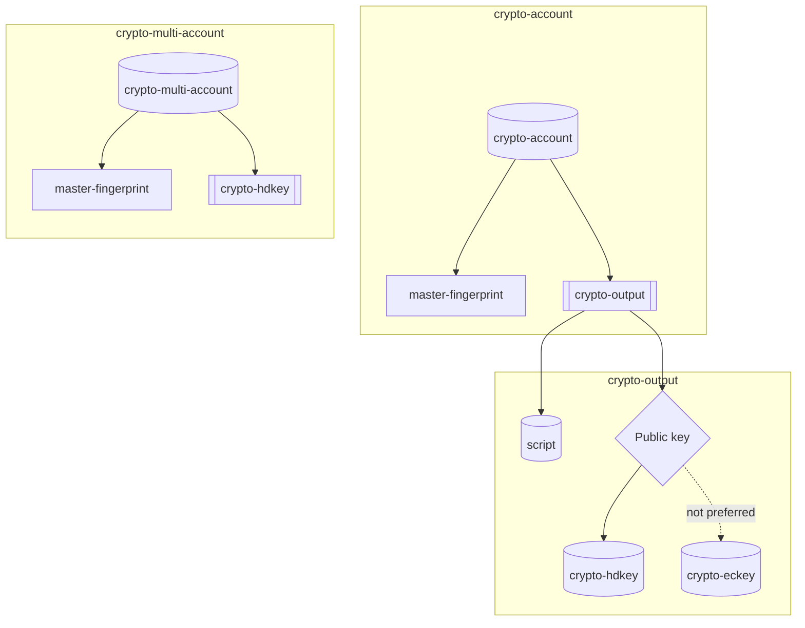
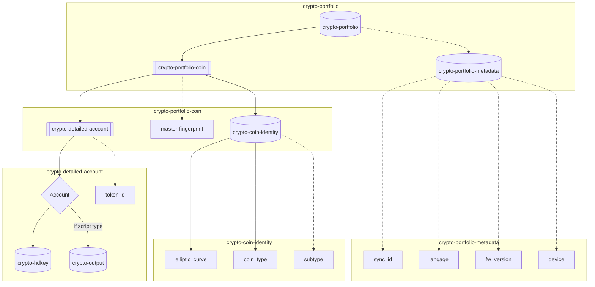

# Sync protocol

## NBCR-2023-002

© 2023 NGRAVE

Authors: Mathieu Da Silva, Irfan Bilaloglu <br/>
Date: April 19, 2023

Revised: May 16, 2023

---

# I - Introduction

The goal of this document is to propose a QR protocol enabling the synchronization of accounts between an offline wallet storing the private keys and a watch-only wallet displaying accounts’ balance and interacting with the blockchain.

This protocol is based on a data format that promotes standards-based sharing of [[BIP44]](https://github.com/bitcoin/bips/blob/master/bip-0044.mediawiki) account level xpubs and other information, allowing devices to join wallets with little to no user interaction required.

This protocol aims to support coins based on both elliptic curves Secp256k1 and Ed25519.

This protocol extends already existing sync protocol:

1) Our own homemade designed protocol working with NGRAVE application LIQUID.

2) A generic sync protocol connecting QR code-based hardware wallet to third party application (as defined in [[EIP-4527]](https://eips.ethereum.org/EIPS/eip-4527) for Ethereum blockchain).

## **Specification**

**Offline signer**: An offline signer is a device or application which holds the user’s private keys and does not have network access.

**Watch-only wallet**: A watch-only wallet is a wallet that has network access and can interact with the blockchain.

## Motivation to use BC-UR types

The BlockchainCommons, referred to as BC, have published a series of data transmission protocol called Uniform Resources (UR). It provides a basic method to encode data into animated QR Codes. The UR have been extended in the [[EIP-4527]](https://eips.ethereum.org/EIPS/eip-4527). The UR types form the basis of the data transmission protocol for the following reasons:

- **Standardization**: a standard already commonly used by other hardware wallets (Keystone, AirGap, CoolWallet, D’Cent).
- **Data compression**: Byte savings using CBOR compared to text encoding.
- **Human-friendly text encoding**: Format is defined as `ur:<type>/<message>` (details can be found [here](https://github.com/BlockchainCommons/Research/blob/master/papers/bcr-2020-005-ur.md))
- **Efficiency of QR code encoding**: data is encoded as CBOR (Concise Binary Object Representation) supporting sizes up to 2^32-1 bytes (~ 4 GB) compared to the largest QR code ("version 40") consisting of 2953 bytes (details can be found in [[BCR-2020-005-UR]](https://github.com/BlockchainCommons/Research/blob/master/papers/bcr-2020-005-ur.md))
- **Time-sequence QR code**: ability to break up messages too large to fit into a QR code into a sequence of QR codes using sophisticated "fountain codes."
- **Error detection**: CRC32 checksum on the entire message in each part to tie them together and ensure the transmitted message has been reconstructed.

## Technical specifications

This document specifies the following limits on the QR code format in order to be able to scan with any devices without requiring the best quality camera.

- The fragment size is fixed at **90 characters** per QR code.
- The time-sequence of QR code is displayed at a fps of **8**.
- The QR code correction level is set to **Medium**.

## Limitation

Despite the generic purpose of this document to standardize a syncing protocol via QR codes, the different blockchains are various and present each their own specificity. We are focusing the sync protocol to support the following blockchains:

- Bitcoin
- Ethereum and other EVM blockchain
- Solana
- Stellar
- Elrond
- Tezos

The integration of a new blockchain should reuse as much as possible the generic communication protocol introduced in this document.

This document is limited to the detailed description of the synchronization process between the offline signer and the watch-only wallet. The signing protocol via QR codes is discussed in [[NBCR-2023-003]](https://github.com/ngraveio/Research/blob/main/papers/nbcr-2023-003-crypto-sign.md) specification.

---

# II - Sync protocol

The sync protocol follows the described operations:

1) Offline signer provides the account information in a QR code

2) User scans QR code with the watch-only wallet

3) (optional) User selects accounts to sync in watch-only wallet

4) (optional) Watch-only wallet discovers accounts from extended public keys (for coins supporting [[BIP32]](https://github.com/bitcoin/bips/blob/master/bip-0032.mediawiki))

5) Watch-only wallet displays the user portfolio

Based on a set of UR types listed in this document, the sync communication protocol is divided in three layers of communication, as described in Figure 1. The three layers are used depending on the watch-only wallets’ needs. The hardware wallet should be able to generate the sync payload based on the 3 communication layers. 



Figure 1. Illustration of the 3 layers of communication to sync accounts.

The first layer is based on the `crypto-hdkey` UR type proposed by BC in [[BCR-2020-007]](https://github.com/BlockchainCommons/Research/blob/master/papers/bcr-2020-007-hdkey.md) to share a single xpub key with the watch-only wallet.

The second layer is based on two UR types: 1) `crypto-account` proposed by BC in [[BCR-2020-015]](https://github.com/BlockchainCommons/Research/blob/master/papers/bcr-2020-015-account.md)  to share a script along with an xpub key, 2) `crypto-multi-account` introduced by Keystone in [[solana-qr-data-protocol]](https://github.com/KeystoneHQ/Keystone-developer-hub/blob/main/research/solana-qr-data-protocol.md#setup-watch-only-wallet-by-offline-signer) to share multiple public keys with the watch-only wallet (e.g. with coins based on ed25519 curves where each account contains a fully hardened derivation path).

Finally we propose in this document a third layer based on the `crypto-portfolio` UR type extended the two other layers to add extra information: 1) by defining a coin identity to specify the elliptic curve and any subtype (e.g. chain ID for EVM chains), 2) by adding token IDs and 3) by sending device-related metadata in the sync payload.

## Sync UR types registry

| Type | [[CBOR Tag]](https://www.iana.org/assignments/cbor-tags/cbor-tags.xhtml) | Owner | Description | Definition |
| --- | --- | --- | --- | --- |
| `crypto-hdkey` | 303 | BlockchainCommons (BC) | Hierarchical Deterministic (HD) key | [[BCR-2020-007]](https://github.com/BlockchainCommons/Research/blob/master/papers/bcr-2020-007-hdkey.md) |
| `crypto-keypath` | 304 | BlockchainCommons (BC) | Key Derivation Path | [[BCR-2020-007]](https://github.com/BlockchainCommons/Research/blob/master/papers/bcr-2020-007-hdkey.md) |
| `crypto-coininfo` | 305 | BlockchainCommons (BC) | Cryptocurrency Coin Use | [[BCR-2020-007]](https://github.com/BlockchainCommons/Research/blob/master/papers/bcr-2020-007-hdkey.md) |
| `crypto-output` | 308 | BlockchainCommons (BC) | Output descriptor associating a script type to a  HD key | [[BCR-2020-010]](https://github.com/BlockchainCommons/Research/blob/master/papers/bcr-2020-010-output-desc.md) |
| `crypto-account` | 311 | BlockchainCommons (BC) | Import an account based on several output descriptors | [[BCR-2020-015]](https://github.com/BlockchainCommons/Research/blob/master/papers/bcr-2020-015-account.md)  |
| `crypto-multi-account` | 1103 | Keystone | Import multiple accounts in one animated QR | [[solana-qr-data-protocol]](https://github.com/KeystoneHQ/Keystone-developer-hub/blob/main/research/solana-qr-data-protocol.md#setup-watch-only-wallet-by-offline-signer) |
| `crypto-coin-identity` | 1401 | Ngrave | Add additional information to a specific hdkey | [[NBCR-2023-001]](https://github.com/ngraveio/Research/blob/main/papers/nbcr-2023-001-coin-identity.md) |
| `crypto-detailed-account` | 1402 | Ngrave | Import multiple accounts with and without output descriptors and specify optionally tokens to synchronize | This document |
| `crypto-portfolio-coin` | 1403 | Ngrave | Associate several accounts to its coin identity  | This document |
| `crypto-portfolio-metadata` | 1404 | Ngrave | Specify wallet metadata | This document |
| `crypto-portfolio` | 1405 | Ngrave | Aggregate the portfolio information | This document |

The specification for each UR type contains CBOR structure, expressed in Concise Data Definition Language [[CDDL]](https://datatracker.ietf.org/doc/html/rfc8610). We specify the breakdown of each UR type in this document regarding the legend described in Figure 2.


Figure 2. Legend for UR type breakdown

### UR registry constituting the layer 1

The first layer of the proposed sync protocol is based on `crypto-hdkey` UR type. This layer aims to synchronize a single public key for a single coin. The synchronized public key can be an extended public key, referred as xpub, from which the watch-only wallet can derive several addresses. 

 We break down its structure in Figure 3 based on two other UR types: `crypto-keypath` and `crypto-coininfo`. The CDDL for each UR type is given hereafter.


Figure 3. Breakdown of crypto-hdkey composing the layer 1 of the Sync protocol. 

- **CDDL for Key Path** `crypto-keypath`

This UR type belongs to the initial registry proposed by BC in [[BCR-2020-007]](https://github.com/BlockchainCommons/Research/blob/master/papers/bcr-2020-007-hdkey.md) and it is used to describe a derivation path `m / purpose' / coin_type' / account' / change / address_index`.

When used embedded in another CBOR structure, this structure should be tagged #6.304.

```
; Metadata for the derivation path of a key.
;
; `source-fingerprint`, if present, is the fingerprint of the
; ancestor key from which the associated key was derived.
;
; If `components` is empty, then `source-fingerprint` MUST be a fingerprint of
; a master key.
;
; `depth`, if present, represents the number of derivation steps in
; the path of the associated key, even if not present in the `components` element
; of this structure.
   crypto-keypath = {
        components: [path-component], ; If empty, source-fingerprint MUST be present
        ? source-fingerprint: uint32 .ne 0 ; fingerprint of ancestor key, or master key if components is empty
        ? depth: uint8 ; 0 if this is a public key derived directly from a master key
    }

    path-component = (
        child-index / child-index-range / child-index-wildcard-range,
        is-hardened
    )

    uint32 = uint .size 4
    uint31 = uint32 .lt 2147483648 ;0x80000000
    child-index = uint31
    child-index-range = [child-index, child-index] ; [low, high] where low < high
    child-index-wildcard = []

    is-hardened = bool

    components = 1
    source-fingerprint = 2
    depth = 3
```

- **CDDL for Coin Info** `crypto-coininfo`

This UR type belongs to the initial registry proposed by BC in [[BCR-2020-007]](https://github.com/BlockchainCommons/Research/blob/master/papers/bcr-2020-007-hdkey.md) and it is used to describe the SLIP44 and the network (mainnet or testnet) of a coin.

When used embedded in another CBOR structure, this structure should be tagged #6.305.

```
; Metadata for the type and use of a cryptocurrency
crypto-coininfo = {
	? type: uint31 .default cointype-btc, ; values from [SLIP44] with high bit turned off
	? network: int .default mainnet ; coin-specific identifier for testnet
}

type = 1
network = 2

cointype-btc = 0
cointype-eth = 0x3c

mainnet = 0;
testnet-btc = 1;

; from [ETH-TEST-NETWORKS]
testnet-eth-ropsten = 1;
testnet-eth-kovan = 2;
testnet-eth-rinkeby = 3;
testnet-eth-gorli = 4;
```

- **CDDL for HDKey** `crypto-hdkey`

This UR type belongs to the initial registry proposed by BC in [[BCR-2020-007]](https://github.com/BlockchainCommons/Research/blob/master/papers/bcr-2020-007-hdkey.md) and it is used to share a public key with its derivation paths.

When used embedded in another CBOR structure, this structure should be tagged #6.303.

```
; An hd-key is either a master key or a derived key.
hd-key = {
	master-key / derived-key
}

; A master key is always private, has no use or derivation information,
; and always includes a chain code.
master-key = (
	is-master: true,
	key-data: key-data-bytes,
	chain-code: chain-code-bytes
)

; A derived key may be private or public, has an optional chain code, and
; may carry additional metadata about its use and derivation.
; To maintain isomorphism with [BIP32] and allow keys to be derived from
; this key `chain-code`, `origin`, and `parent-fingerprint` must be present.
; If `origin` contains only a single derivation step and also contains `source-fingerprint`,
; then `parent-fingerprint` MUST be identical to `source-fingerprint` or may be omitted.
derived-key = (
	? is-private: bool .default false,   ; true if key is private, false if public
	key-data: key-data-bytes,
	? chain-code: chain-code-bytes       ; omit if no further keys may be derived from this key
	? use-info: #6.305(crypto-coininfo), ; How the key is to be used
	? origin: #6.304(crypto-keypath),    ; How the key was derived
	? children: #6.304(crypto-keypath),  ; What children should/can be derived from this
	? parent-fingerprint: uint32 .ne 0,  ; The fingerprint of this key's direct ancestor, per [BIP32]
	? name: text,                        ; A short name for this key.
	? note: text                         ; An arbtrary amount of text describing the key.
)

; If the `use-info` field is omitted, defaults (mainnet BTC key) are assumed.
; If `cointype` and `origin` are both present, then per [BIP44], the second path
; component's `child-index` must match `cointype`.

; The `children` field may be used to specify what set of child keys should or can be derived from this key. This may include `child-index-range` or `child-index-wildcard` as its last component. Any components that specify hardened derivation will require the key be private.

is-master = 1
is-private = 2
key-data = 3
chain-code = 4
use-info = 5
origin = 6
children = 7
parent-fingerprint = 8
name = 9
note = 10

uint8 = uint .size 1
key-data-bytes = bytes .size 33
chain-code-bytes = bytes .size 32
```

### UR registry constituting the layer 2

The second layer of the proposed sync protocol is based on `crypto-multi-account` and `crypto-account` UR types, wrapping as lists `crypto-hdkey` and `crypto-output` respectively. 

When using `crypto-multi-account`, this layer aims to synchronize several public keys for the same coin. While when using `crypto-account`, this layer aims to add script types for each synchronized public key.

We break down their structures in Figure 4. The CDDL for `crypto-hdkey` has been described in the previous Section. The CDDL for the other UR types are given hereafter.


Figure 4. Breakdown of crypto-multi-account and crypto-account forming the layer 2 of the Sync protocol

- **CDDL for output descriptor** `crypto-output`

This UR type belongs to the initial registry proposed by BC in [[BCR-2020-010]](https://github.com/BlockchainCommons/Research/blob/master/papers/bcr-2020-010-output-desc.md) to describe a standardized script types along with a public key.

When used embedded in another CBOR structure, this structure should be tagged #6.308.

```
key_exp = #6.306(crypto-eckey) / #6.303(crypto-hdkey)

script_exp = (
  script-hash /               ; sh
  witness-script-hash /       ; wsh
  public-key /                ; pk
  public-key-hash /           ; pkh
  witness-public-key-hash /   ; wpkh
  combo /                     ; combo
  multisig /                  ; multi
  sorted-multisig /           ; sortedmulti
  address /                   ; addr
  raw-script /                ; raw
  taproot /                   ; tr
  cosigner                    ; cosigner
)

script-hash = #6.400(script_exp)
witness-script-hash = #6.401(script_exp)
public-key = #6.402(key_exp)
public-key-hash = #6.403(key_exp)
witness-public-key-hash = #6.404(key_exp)
combo = #6.405(key_exp)
multikey = {
	threshold: uint,
	keys: [1* key_exp]
}
multisig = #6.406(multikey)
sorted-multisig = #6.407(multikey)
address = #6.307(crypto-address)
raw-script = #6.408(script-bytes)
taproot = #6.409(script_exp)
cosigner = #6.410(key_exp)

threshold = 1
keys = 2

script-bytes = bytes
```

In the proposed sync protocol, the recommendation for using the output descriptor is to prefer using `crypto-hdkey` instead of `crypto-eckey`, since `crypto-eckey` as described in [[BCR-2020-008]](https://github.com/BlockchainCommons/Research/blob/master/papers/bcr-2020-008-eckey.md) does not contain information related to the derivation path.

- **CDDL for several accounts with their output descriptors** `crypto-account`

This UR type belongs to the initial registry proposed by BC in [[BCR-2020-015]](https://github.com/BlockchainCommons/Research/blob/master/papers/bcr-2020-015-account.md) and is used to share a number of standardized script types along with their common derivations to the account level.

The following standardized script types may be present in a `crypto-account` encoding, shown here with default derivations for Bitcoin mainnet and account #0:

| Script type | Default Derivation |
| --- | --- |
| P2PKH | m/44'/0'/0' |
| P2SH-P2WPKH | m/49'/0'/0' |
| P2WPKH | m/84'/0'/0' |
| Multisig cosigner P2SH | m/45' |
| Multisig cosigner P2SH-P2WSH | m/48'/0'/0'/1' |
| Multisig cosigner P2WSH | m/48'/0'/0'/2' |
| Single key P2TR | m/86'/0'/0' |

When used embedded in another CBOR structure, this structure should be tagged #6.311.

```
; Output descriptors here are restricted to HD keys at account level key derivations only (no 0/* or 1/* children crypto-keypaths)

output_exp = #6.308(crypto-output)

account = {
    master-fingerprint: uint32, ; Master fingerprint (fingerprint for the master public key as per BIP32)
    output-descriptors: [+ output-exp] ; Output descriptors for various script types for this account
}

master-fingerprint = 1
output-descriptors = 2
```

- **CDDL for multiple accounts without their output descriptors** `crypto-multi-account`

This UR type has been added to the initial registry by keystone in [[solana-qr-data-protocol]](https://github.com/KeystoneHQ/Keystone-developer-hub/blob/main/research/solana-qr-data-protocol.md#setup-watch-only-wallet-by-offline-signer) in order to be able to send multiple `crypto-hdkey` describing several accounts of the same coin.

When used embedded in another CBOR structure, this structure should be tagged #6.1103.

```
key_exp = #6.303(crypto-hdkey)

accounts = {
    master-fingerprint: uint32, ; Master fingerprint (fingerprint for the master public key as per BIP32)
    keys: [+ key_exp]           ; Different account keys for a offline signer.
    ? device: string            ; Indicates the origin of these accounts, e.g. 'Keystone'
}

master-fingerprint = 1
keys = 2
device = 3
```

### UR registry constituting the layer 3

The third layer of the proposed sync protocol is based on `crypto-portfolio` UR type, aiming to synchronize the accounts related to multiple coins.

We break down its structure in Figure 5 based on newly defined UR types: `crypto-portfolio-coin`, `crypto-coin-identity`, `crypto-detailed-account` and `crypto-portfolio-metadata`. The CDDL for the new UR types are given hereafter.


Figure 5. Breakdown of crypto-portfolio forming the layer 3 of the sync protocol

- **CDDL for synchronizing several accounts with detailed information** `crypto-detailed-account`

In this document, we are defining the new `crypto-detailed-account` UR type, extending the scope of the previously defined `crypto-account` and `crypto-multi-account` UR types in [UR registry constituting the layer 2](nbcr-2023-002-multi-layer-sync.md#ur-registry-constituting-the-layer-2). The information contained in `crypto-account` and `crypto-multi-account` can be easily converted to `crypto-detailed-account` type.

This new type aims to incorporate in the same structure:

- The accounts with and without scripts by selecting either `crypto-hdkey` or `crypto-output.`
- An optional list of tokens to synchronize them at the same time of the associated account. A token identifier is defined as a string or tagged with #6.263 to specify a [[hexString]](https://github.com/toravir/CBOR-Tag-Specs/blob/master/hexString.md).

The following specification of `crypto-detailed-account` is written in CDDL. When used embedded in another CBOR structure, this structure should be tagged #6.1402.

```
account_exp = #6.303(crypto-hdkey) / #6.308(crypto-output)

; Accounts are specified using either '#6.303(crypto-hdkey)' or 
; '#6.308(crypto-output)'.
; By default, '#6.303(crypto-hdkey)' should be used to share public keys and
; extended public keys.
; '#6.308(crypto-output)' should be used to share an output descriptor, 
; e.g. for multisig.

hex_string = #6.263(bstr) ; byte string is a hexadecimal string no need for decoding
token-id = string / hex_string

; Optional 'token-ids' to indicate the synchronization of a list of tokens with
; the associated accounts
; 'token-id' is defined differently depending on the blockchain:
; - ERC20 tokens on EVM chains are identified by their contract addresses 
; (e.g. `0xA0b86991c6218b36c1d19D4a2e9Eb0cE3606eB48`)
; - ERC1155 tokens are identifed with their contract addresses followed by their 
; ID with ':' as separator (e.g. `0xfaafdc07907ff5120a76b34b731b278c38d6043c:
; 508851954656174721695133294256171964208`)
; - ESDT tokens on MultiversX are by their name followed by their ID with `-` as 
; separator (e.g. `USDC-c76f1f`)
; - SPL tokens on Solana are identified by their contract addresses
; (e.g. `EPjFWdd5AufqSSqeM2qN1xzybapC8G4wEGGkZwyTDt1v`)

detailed-account = { 
  account: account_exp,
  ? token-ids: [+ token-id],  ; Specify multiple tokens associated to one account
}

account = 1
token-ids = 2
```

- **CDDL for synchronizing accounts with their coin identity** `crypto-portfolio-coin`

In this document, we are defining the new `crypto-portfolio-coin` UR type associating the `crypto-coin-identity` defined in [[NBCR-2023-001]](https://github.com/ngraveio/Research/blob/main/papers/nbcr-2023-001-coin-identity.md) with their accounts. The accounts are preferrably defined using a list of `crypto-detailed-account`. 

To keep full compatibility with the layer 2, the accounts can also be specified using `crypto-account` and `crypto-multi-account` UR types. Using these UR types will however limit the information which can be synchronized.

The following specification of `crypto-portfolio-coin` is written in CDDL. When used embedded in another CBOR structure, this structure should be tagged #6.1403.

```
; Associate a coin identity to its accounts

detailed_accounts = [+ #6.1402(crypto-detailed-account)]

; The accounts are listed using #6.1402(crypto-detailed-account) to share the maximum of information related to the accounts

coin = {
  coin-id: #6.1401(crypto-coin-identity),
  accounts: accounts_exp,
  ? master-fingerprint: uint32, ; Master fingerprint (fingerprint for the master public key as per BIP32)
}

coin-id = 1
accounts = 2
```

- **CDDL for syncing metadata** `crypto-portfolio-metadata`

In this document, we are defining the new `crypto-portfolio-metadata` UR type to include device metadata related to the offline signer.

In many QR-based offline signer, the synchronization payload includes metadata information related to the device. We have created a general purpose UR type to include such information.

When used embedded in another CBOR structure, this structure should be tagged #6.1404.

```
metadata = {
		? sync_id: bytes .size 16     ; Generated by the hardware wallet to identify 
the device
		? language: language_code,    ; Indicates the selected language selected 
on the hardware wallet
		? fw_version: string,         ; Firmware version of the hardware wallet
		? device: string              ; Indicates the device name
}

sync_id = 1
language = 2
fw_version = 3
device = 4

language_code = string ; following [ISO 639-1] Code (e.g. "en" for English, 
"fr" for French, "nl" for Dutch and "es" for Spanish
```

The language is encoded with alpha-2 code to represent the names of the language following [[ISO 639-1]](https://www.iso.org/standard/22109.html).

- **CDDL for syncing the general purpose payload** `crypto-portfolio`

In this document, we are defining the new UR type `crypto-portfolio` to aggregate accounts, coin identity and metadata information together.

When used embedded in another CBOR structure, this structure should be tagged #6.1405.

```
; Top level multi coin sync payload
; All master-fingerprint fields must match within the included UR types
sync = {
		coins: [+ #6.1402(crypto-portfolio-coin)]           ; Multiple coins with their respective accounts and coin identities
		? metadata: #6.1403(crypto-portfolio-metadata) ; Optional wallet metadata
}

coins = 1
metadata = 2
```

## Sync communication layers

The online watch-only wallet has different needs regarding the information needed to be synced from the hardware wallet. Depending on the needs, the sync protocol will create a payload based on 3 layers:

1) Sync the accounts of a single coin by sharing a single extended public key and his derivation path  using `crypto-hdkey` UR type (e.g. an Ethereum xpub with Metamask as watch-only wallet).

2) Sync the accounts of a single coin when additional information are required:

   a. The accounts are defined with different output descriptors using `crypto-account` UR type (e.g. Bitcoin accounts with different type script with Sparrow wallet as watch-only wallet).     
   b. The accounts of the same coin are defined by several public keys and different derivation paths using `crypto-multi-accounts` UR type (e.g. Solana accounts with fully hardened derivation paths with Solflare wallet as watch-only wallet). 

3) Sync the accounts of multiple coins identified with their coin identity, along with optional tokens information and device-related metadata, using `crypto-portfolio` UR type (e.g. synchronization with NGRAVE Liquid application or Trust Wallet as watch-only wallets)

### 1) Sync a single coin based on a unique extended public key (Metamask case)

In the first layer of the sync protocol, the watch-only wallet requires only to receive the extended public key in [[BIP32]](https://github.com/bitcoin/bips/blob/master/bip-0032.mediawiki) format along with the derivation path in [[BIP44]](https://github.com/bitcoin/bips/blob/master/bip-0044.mediawiki) format, contained in `crypto-hdkey` UR type. 

The watch-only wallet is able to derive and to synchronize the different accounts associated to the extended public key.

The first layer is privileged when the watch-only wallet requires only the synchronization of a single coin with its extended public key, e.g. Metamask with an ETH xpub to derive the accounts for all the EVM-compatible blockchains. 

**Use case**

The offline signer creates a sync payload containing the mandatory following fields:

- Key data
- Chain code
- Origin derivation path containing the hardened derivation path of the xpub (e.g. `m/44’/60’/0’`)
- Parent fingerprint

The watch-only wallet reconstructs the xpub and proposes to the user the derived accounts. 

**Example**

An example illustrates how the sync payload is formed using the first layer of communication:

<details>

<summary>Layer 1 example from [BCR-2020-007] for syncing ETH xpub `m/44’/60’/0’`</summary>

- XPUB:
    
```
xpub6CRQif2S43vtEYf5cZdMhrFpuBFkgFkALM6qhJZz7ws2cfEf1f8Jiv8dXSkizobckHyfH1mFDFZn46AJoh8d4FpB6ydFFg49yPkJF69GsHq
```
- Decoded from Base58
``` 0488b21e0368b6e8a8800000001d710954e58073f927f283c61bc1428ac30a3d86d04dacb3a78613401f7818390204fa032947600aae94a889dfc31b5c96afcb7f7e23a189114b71e0254c4b88b5b6d9d2d0
```
- Separated into fields specified in [BIP32] 
```
04 ; version 4
88b21e ; `xpub`
03 ; depth 3 == number of derivation steps in the patch of the associated key
68b6e8a8 ; parent fingerprint == the fingerprint of the ancestor key from which the associated key was derived.
80000000 ; child number
1d710954e58073f927f283c61bc1428ac30a3d86d04dacb3a78613401f781839 ; chain code
0204fa032947600aae94a889dfc31b5c96afcb7f7e23a189114b71e0254c4b88b5 ; key data
b6d9d2d0 ; base58 checksum
``` 
- CBOR encoding (see [playground](https://cbor.me/?diag=5D90131A1020006D90130A20186182CF5183CF500F5021A68B6E8A8081A68B6E8A809664E4752415645)) 
```
A7                                      # map(7)
01                                   # unsigned(1) is-master
F4                                   # primitive(20) false
03                                   # unsigned(3) key-data
58 21                                # bytes(33)
  0204FA032947600AAE94A889DFC31B5C96AFCB7F7E23A189114B71E0254C4B88B5
04                                   # unsigned(4) chain-code
58 20                                # bytes(32) 
  1D710954E58073F927F283C61BC1428AC30A3D86D04DACB3A78613401F781839 
05                                   # unsigned(5) use-info
D9 0131                              # tag(305) #6.305(crypto-coininfo)
  A1                                # map(1)
     02                             # unsigned(2) network
     00                             # unsigned(0) mainnet
06                                   # unsigned(6) origin
D9 0130                              # tag(304) #6.304(crypto-keypath)
  A2                                # map(2) 
     01                             # unsigned(1) derivation path
     86                             # array(6)
	18 2C                       # unsigned(44) 44
	F5                          # primitive(21) true
	18 3C                       # unsigned(60) 60
	F5                          # primitive(21) true
	00                          # unsigned(0) 0
	F5                          # primitive(21) true
     02                             # unsigned(2) source-fingerprint
     1A 68B6E8A8                    # unsigned(1756817576)
08                                   # unsigned(8) parent-fingerprint
1A 68B6E8A8                          # unsigned(1756817576)
09                                   # unsigned(9) name
66                                   # text(6)
  4E4752415645                      # "NGRAVE"
```
- UR encoding
```
ur:crypto-hdkey/osadwkaxhdclaoaazsaxdtflhnbkplmwpdldursrcwhhmtpesblbkbcnoyldbygrjsvtdagsgrloreaahdcxcajsasghvwlajkytdiwzlsswcwsefwlesrbkfslntigtpsqdoslnbwfzctkscsesahtaadehoyaoaeamtaaddyoeadlncsdwykcsfnykaeykaocyisrpvspdaycyisrpvspdasiyglflgmfphffeytmevoee
```

</details> 

### 2.a) Sync a single coin along with output descriptors (Sparrow wallet case)

In the first case of the second layer of the sync protocol, the watch-only wallet requires to receive output descriptors with the coin information. This case includes the coins as Bitcoin where a script type is specified in addition of an extended public key, both information are contained in `crypto-account` UR type.

The first case of the second layer is privileged with a watch-only wallet synchronizing only coins based on script types, e.g. Sparrow wallet with Bitcoin accounts.

**Use case**

The offline signer creates a sync payload containing the mandatory following fields:

- Master fingerprint
- List of output descriptors
    - Script type (e.g. multisig, taproot)
    - Key data
    - Chain code
    - Origin derivation path containing the hardened derivation path of the xpub (e.g. `m/44’/0’/0’`)
    - Parent fingerprint

The watch-only wallet reconstructs the xpub for each derivation path and script type and proposes to the user the derived accounts. 

<details>

<summary>Layer 2.a example from [BCR-2020-015] for syncing BTC accounts</summary>

- BTC accounts

```
pkh([37b5eed4/44'/0'/0']xpub6CnQkivUEH9bSbWVWfDLCtigKKgnSWGaVSRyCbN2QNBJzuvHT1vUQpgSpY1NiVvoeNEuVwk748Cn9G3NtbQB1aGGsEL7aYEnjVWgjj9tefu)
sh(wpkh([37b5eed4/49'/0'/0']xpub6CtR1iF4dZPkEyXDwVf3HE74tSwXNMcHtBzX4gwz2UnPhJ54Jz5unHx2syYCCDkvVUmsmoYTmcaHXe1wJppvct4GMMaN5XAbRk7yGScRSte))
wpkh([37b5eed4/84'/0'/0']xpub6BkU445MSEBXbPjD3g2c2ch6mn8yy1SXXQUM7EwjgYiq6Wt1NDwDZ45npqWcV8uQC5oi2gHuVukoCoZZyT4HKq8EpotPMqGqxdZRuapCQ23)
sh(cosigner([37b5eed4/45']xpub68JFLJTH96GUqC6SoVw5c2qyLSt776PGu5xde8ddVACuPYyarvSL827TbZGavuNbKQ8DG3VP9fCXPhQRBgPrS4MPG3zaZgwAGuPHYvVuY9X))
sh(wsh(cosigner([37b5eed4/48'/0'/0'/1']xpub6EC9f7mLFJQoPaqDJ72Zbv67JWzmpXvCYQSecER9GzkYy5eWLsVLbHnxoAZ8NnnsrjhMLduJo9dG6fNQkmMFL3Qedj2kf5bEy5tptHPApNf)))
wsh(cosigner([37b5eed4/48'/0'/0'/2']xpub6EC9f7mLFJQoRQ6qiTvWQeeYsgtki6fBzSUgWgUtAujEMtAfJSAn3AVS4KrLHRV2hNX77YwNkg4azUzuSwhNGtcq4r2J8bLGMDkrQYHvoed))
tr([37b5eed4/86'/0'/0']xpub6DAvL2L5bgGSpDygSQUDpjwE47saoMk2rSRtYhN7Dma7HvnFLTXNrcSC1AmEN8G2SCD958bUwgc6Bew4sAFa2kqYynF8Rmu6P5jMt2FDPtm)
```

- CBOR diagnosis format

```
{
1: 934670036, ; master key fingerprint
2: [ ; array of output descriptors
308( ; crypto-output
  403( ; public-key-hash
    303({ ; crypto-hdkey
      3: h'03EB3E2863911826374DE86C231A4B76F0B89DFA174AFB78D7F478199884D9DD32', ; key-data
      4: h'6456A5DF2DB0F6D9AF72B2A1AF4B25F45200ED6FCC29C3440B311D4796B70B5B', ; chain-code
      6: 304({ ; origin: crypto-keypath
	1: [44, true, 0, true, 0, true], ; components 44'/0'/0'
	2: 934670036 ; source-fingerprint (master key fingerprint)
      }),
      8: 2583285239 ; parent fingerprint
    })
  )
),
308( ; crypto-output
  400( ; script-hash
    404( ; witness-public-key-hash
      303({ ; crypto-hdkey
	3: h'02C7E4823730F6EE2CF864E2C352060A88E60B51A84E89E4C8C75EC22590AD6B69', ; key-data
	4: h'9D2F86043276F9251A4A4F577166A5ABEB16B6EC61E226B5B8FA11038BFDA42D', ; chain-code
	6: 304({ ; origin: crypto-keypath
	  1: [49, true, 0, true, 0, true], ; components 49'/0'/0'
	  2: 934670036 ; source-fingerprint (master key fingerprint)
	}),
	8: 2819587291 ; parent fingerprint
      })
    )
  )
),
308( ; crypto-output
  404( ; witness-public-key-hash
    303({ ; crypto-hdkey
      3: h'03FD433450B6924B4F7EFDD5D1ED017D364BE95AB2B592DC8BDDB3B00C1C24F63F', ; key-data
      4: h'72EDE7334D5ACF91C6FDA622C205199C595A31F9218ED30792D301D5EE9E3A88', ; chain-code
      6: 304({ ; origin: crypto-keypath
	1: [84, true, 0, true, 0, true], ; components 84'/0'/0'
	2: 934670036 ; source-fingerprint (master key fingerprint)
      }),
      8: 224256471
    })
  )
),
308( ; crypto-output ; parent fingerprint
  400( ; script-hash
    410( ; cosigner
      303({ ; crypto-hdkey
	3: h'035CCD58B63A2CDC23D0812710603592E7457573211880CB59B1EF012E168E059A', ; key-data
	4: h'88D3299B448F87215D96B0C226235AFC027F9E7DC700284F3E912A34DAEB1A23', ; chain-code
	6: 304({ ; origin: crypto-keypath
	  1: [45, true], ; components 45'/0'
	  2: 934670036 ; source-fingerprint (master key fingerprint)
	}),
	8: 934670036
      })
    )
  )
),
308( ; crypto-output
  400( ; script-hash
    401( ; witness-script-hash
      410( ; cosigner
	303({ ; crypto-hdkey
	  3: h'032C78EBFCABDAC6D735A0820EF8732F2821B4FB84CD5D6B26526938F90C050711', ; key-data
	  4: h'7953EFE16A73E5D3F9F2D4C6E49BD88E22093BBD85BE5A7E862A4B98A16E0AB6', ; chain-code
	  6: 304({ ; origin: crypto-keypath
	    1: [48, true, 0, true, 0, true, 1, true], ; components 48'/0'/0'/1'
	    2: 934670036 ; source-fingerprint (master key fingerprint)
	  }),
	  8: 1505139498 ; parent fingerprint
	})
      )
    )
  )
),
308( ; crypto-output
  401( ; witness-script-hash
    410( ; cosigner
      303({ ; crypto-hdkey
	3: h'0260563EE80C26844621B06B74070BAF0E23FB76CE439D0237E87502EBBD3CA346', ; key-data
	4: h'2FA0E41C9DC43DC4518659BFCEF935BA8101B57DBC0812805DD983BC1D34B813', ; chain-code
	6: 304({ ; origin: crypto-keypath
	  1: [48, true, 0, true, 0, true, 2, true], ; components 48'/0'/0'/2'
	  2: 934670036 ; source-fingerprint (master key fingerprint)
	}),
	8: 1505139498 ; parent fingerprint
      })
    )
  )
),
308( ; crypto-output
  409( ; taproot
    303({ ; crypto-hdkey
      3: h'02BBB97CF9EFA176B738EFD6EE1D4D0FA391A973394FBC16E4C5E78E536CD14D2D', ; key-data
      4: h'4B4693E1F794206ED1355B838DA24949A92B63D02E58910BF3BD3D9C242281E6', ; chain-code
      6: 304({ ; origin: crypto-keypath
	1: [86, true, 0, true, 0, true], ; components 86'/0'/0'
	2: 934670036 ; source-fingerprint (master key fingerprint)
      }),
      8: 3469149964 ; parent fingerprint
    })
  )
)
]
}
```

- CBOR encoding

```
A2                                      # map(2)
01                                   # unsigned(1)
1A 37B5EED4                          # unsigned(934670036)
02                                   # unsigned(2)
87                                   # array(7)
  D9 0134                           # tag(308)
     D9 0193                        # tag(403)
	D9 012F                     # tag(303)
	   A4                       # map(4)
	      03                    # unsigned(3)
	      58 21                 # bytes(33)
		 03EB3E2863911826374DE86C231A4B76F0B89DFA174AFB78D7F478199884D9DD32
	      04                    # unsigned(4)
	      58 20                 # bytes(32)
		 6456A5DF2DB0F6D9AF72B2A1AF4B25F45200ED6FCC29C3440B311D4796B70B5B
	      06                    # unsigned(6)
	      D9 0130               # tag(304)
		 A2                 # map(2)
		    01              # unsigned(1)
		    86              # array(6)
		       18 2C        # unsigned(44)
		       F5           # primitive(21)
		       00           # unsigned(0)
		       F5           # primitive(21)
		       00           # unsigned(0)
		       F5           # primitive(21)
		    02              # unsigned(2)
		    1A 37B5EED4     # unsigned(934670036)
	      08                    # unsigned(8)
	      1A 99F9CDF7           # unsigned(2583285239)
  D9 0134                           # tag(308)
     D9 0190                        # tag(400)
	D9 0194                     # tag(404)
	   D9 012F                  # tag(303)
	      A4                    # map(4)
		 03                 # unsigned(3)
		 58 21              # bytes(33)
		    02C7E4823730F6EE2CF864E2C352060A88E60B51A84E89E4C8C75EC22590AD6B69
		 04                 # unsigned(4)
		 58 20              # bytes(32)
		    9D2F86043276F9251A4A4F577166A5ABEB16B6EC61E226B5B8FA11038BFDA42D
		 06                 # unsigned(6)
		 D9 0130            # tag(304)
		    A2              # map(2)
		       01           # unsigned(1)
		       86           # array(6)
			  18 31     # unsigned(49)
			  F5        # primitive(21)
			  00        # unsigned(0)
			  F5        # primitive(21)
			  00        # unsigned(0)
			  F5        # primitive(21)
		       02           # unsigned(2)
		       1A 37B5EED4  # unsigned(934670036)
		 08                 # unsigned(8)
		 1A A80F7CDB        # unsigned(2819587291)
  D9 0134                           # tag(308)
     D9 0194                        # tag(404)
	D9 012F                     # tag(303)
	   A4                       # map(4)
	      03                    # unsigned(3)
	      58 21                 # bytes(33)
		 03FD433450B6924B4F7EFDD5D1ED017D364BE95AB2B592DC8BDDB3B00C1C24F63F
	      04                    # unsigned(4)
	      58 20                 # bytes(32)
		 72EDE7334D5ACF91C6FDA622C205199C595A31F9218ED30792D301D5EE9E3A88
	      06                    # unsigned(6)
	      D9 0130               # tag(304)
		 A2                 # map(2)
		    01              # unsigned(1)
		    86              # array(6)
		       18 54        # unsigned(84)
		       F5           # primitive(21)
		       00           # unsigned(0)
		       F5           # primitive(21)
		       00           # unsigned(0)
		       F5           # primitive(21)
		    02              # unsigned(2)
		    1A 37B5EED4     # unsigned(934670036)
	      08                    # unsigned(8)
	      1A 0D5DE1D7           # unsigned(224256471)
  D9 0134                           # tag(308)
     D9 0190                        # tag(400)
	D9 019A                     # tag(410)
	   D9 012F                  # tag(303)
	      A4                    # map(4)
		 03                 # unsigned(3)
		 58 21              # bytes(33)
		    035CCD58B63A2CDC23D0812710603592E7457573211880CB59B1EF012E168E059A
		 04                 # unsigned(4)
		 58 20              # bytes(32)
		    88D3299B448F87215D96B0C226235AFC027F9E7DC700284F3E912A34DAEB1A23
		 06                 # unsigned(6)
		 D9 0130            # tag(304)
		    A2              # map(2)
		       01           # unsigned(1)
		       82           # array(2)
			  18 2D     # unsigned(45)
			  F5        # primitive(21)
		       02           # unsigned(2)
		       1A 37B5EED4  # unsigned(934670036)
		 08                 # unsigned(8)
		 1A 37B5EED4        # unsigned(934670036)
  D9 0134                           # tag(308)
     D9 0190                        # tag(400)
	D9 0191                     # tag(401)
	   D9 019A                  # tag(410)
	      D9 012F               # tag(303)
		 A4                 # map(4)
		    03              # unsigned(3)
		    58 21           # bytes(33)
		       032C78EBFCABDAC6D735A0820EF8732F2821B4FB84CD5D6B26526938F90C050711
		    04              # unsigned(4)
		    58 20           # bytes(32)
		       7953EFE16A73E5D3F9F2D4C6E49BD88E22093BBD85BE5A7E862A4B98A16E0AB6
		    06              # unsigned(6)
		    D9 0130         # tag(304)
		       A2           # map(2)
			  01        # unsigned(1)
			  88        # array(8)
			     18 30  # unsigned(48)
			     F5     # primitive(21)
			     00     # unsigned(0)
			     F5     # primitive(21)
			     00     # unsigned(0)
			     F5     # primitive(21)
			     01     # unsigned(1)
			     F5     # primitive(21)
			  02        # unsigned(2)
			  1A 37B5EED4 # unsigned(934670036)
		    08              # unsigned(8)
		    1A 59B69B2A     # unsigned(1505139498)
  D9 0134                           # tag(308)
     D9 0191                        # tag(401)
	D9 019A                     # tag(410)
	   D9 012F                  # tag(303)
	      A4                    # map(4)
		 03                 # unsigned(3)
		 58 21              # bytes(33)
		    0260563EE80C26844621B06B74070BAF0E23FB76CE439D0237E87502EBBD3CA346
		 04                 # unsigned(4)
		 58 20              # bytes(32)
		    2FA0E41C9DC43DC4518659BFCEF935BA8101B57DBC0812805DD983BC1D34B813
		 06                 # unsigned(6)
		 D9 0130            # tag(304)
		    A2              # map(2)
		       01           # unsigned(1)
		       88           # array(8)
			  18 30     # unsigned(48)
			  F5        # primitive(21)
			  00        # unsigned(0)
			  F5        # primitive(21)
			  00        # unsigned(0)
			  F5        # primitive(21)
			  02        # unsigned(2)
			  F5        # primitive(21)
		       02           # unsigned(2)
		       1A 37B5EED4  # unsigned(934670036)
		 08                 # unsigned(8)
		 1A 59B69B2A        # unsigned(1505139498)
  D9 0134                           # tag(308)
     D9 0199                        # tag(409)
	D9 012F                     # tag(303)
	   A4                       # map(4)
	      03                    # unsigned(3)
	      58 21                 # bytes(33)
		 02BBB97CF9EFA176B738EFD6EE1D4D0FA391A973394FBC16E4C5E78E536CD14D2D
	      04                    # unsigned(4)
	      58 20                 # bytes(32)
		 4B4693E1F794206ED1355B838DA24949A92B63D02E58910BF3BD3D9C242281E6
	      06                    # unsigned(6)
	      D9 0130               # tag(304)
		 A2                 # map(2)
		    01              # unsigned(1)
		    86              # array(6)
		       18 56        # unsigned(86)
		       F5           # primitive(21)
		       00           # unsigned(0)
		       F5           # primitive(21)
		       00           # unsigned(0)
		       F5           # primitive(21)
		    02              # unsigned(2)
		    1A 37B5EED4     # unsigned(934670036)
	      08                    # unsigned(8)
	      1A CEC7070C           # unsigned(3469149964)
```

- UR encoding

```
ur:crypto-account/oeadcyemrewytyaolttaadeetaadmutaaddloxaxhdclaxwmfmdeiamecsdsemgtvsjzcncygrkowtrontzschgezokstswkkscfmklrtauteyaahdcxiehfonurdppfyntapejpproypegrdawkgmaewejlsfdtsrfybdehcaflmtrlbdhpamtaaddyoeadlncsdwykaeykaeykaocyemrewytyaycynlytsnyltaadeetaadmhtaadmwtaaddloxaxhdclaostvelfemdyynwydwyaievosrgmambklovabdgypdglldvespsthysadamhpmjeinaahdcxntdllnaaeykoytdacygegwhgjsiyonpywmcmrpwphsvodsrerozsbyaxluzcoxdpamtaaddyoeadlncsehykaeykaeykaocyemrewytyaycypdbskeuytaadeetaadmwtaaddloxaxhdclaxzcfxeegdrpmogrgwkbzctlttweadkiengrwlhtprremouoluutqdpfbncedkynfhaahdcxjpwevdeogthttkmeswzcolcpsaahcfnshkhtehytclmnteatmoteadtlwynnftloamtaaddyoeadlncsghykaeykaeykaocyemrewytyaycybthlvytstaadeetaadmhtaadnytaaddloxaxhdclaxhhsnhdrpftdwuocntilydibehnecmovdfekpjkclcslasbhkpawsaddmcmmnahnyaahdcxlotedtndfymyltclhlmtpfsadscnhtztaolbnnkistaedegwfmmedreetnwmcycnamtaaddyoeadlfcsdpykaocyemrewytyaycyemrewytytaadeetaadmhtaadmetaadnytaaddloxaxhdclaxdwkswmztpytnswtsecnblfbayajkdldeclqzzolrsnhljedsgminetytbnahatbyaahdcxkkguwsvyimjkvwteytwztyswvendtpmncpasfrrylprnhtkblndrgrmkoyjtbkrpamtaaddyoeadlocsdyykaeykaeykadykaocyemrewytyaycyhkrpnddrtaadeetaadmetaadnytaaddloxaxhdclaohnhffmvsbndslrfgclpfjejyatbdpebacnzokotofxntaoemvskpaowmryfnotfgaahdcxdlnbvecentssfsssgylnhkrstoytecrdlyadrekirfaybglahltalsrfcaeerobwamtaaddyoeadlocsdyykaeykaeykaoykaocyemrewytyaycyhkrpnddrtaadeetaadnltaaddloxaxhdclaorkrhkeytwsoykorletwstbwycagtbsotmeptjkesgwrfcmveskvdmngujzttgtdpaahdcxgrfgmuvyylmwcxjtttechplslgoegagaptdniatidmhdmebdwfryfsnsdkcplyvaamtaaddyoeadlncshfykaeykaeykaocyemrewytyaycytostatbngmdavolk
```
 </details>   

### 2.b) Sync a single coin based on multiple public keys (Solflare case)

In the second case of the second layer of the sync protocol, the watch-only requires to receive the coin information with a public key for each account. This case includes the coins based on ed25519 curve where their derivation paths are fully hardened, and therefore the use of `crypto-hdkey` alone is not possible. The `crypto-multi-accounts` UR type is preferred to embed an array of `crypto-hdkey` UR type, corresponding to each full hardened derivation path with its public key.

The second case of the second layer is privileged with a watch-only wallet synchronizing only coins based on ed25519 curve, e.g. Solflare with Solana accounts. 

**Use case**

The offline signer creates a sync payload containing the mandatory following fields:

- Master fingerprint
- List of shared accounts
    - Key data
    - Chain code
    - Origin derivation path, containing the full hardened path of the address for ed25519 coins (e.g. `m/44’/501’/0’/0’`)
    - Parent fingerprint

The watch-only wallet reconstructs:

- The public addresses derived from the full hardened path for ed25519 coins.

**Examples**

Several examples illustrate how the sync payload is formed using the second layer of communication:

<details>

<summary>Layer 2.b example for syncing SOL accounts</summary>

- Public key derived following SLIP-044:
    
```
GovgcGs4SvM7SdkDHdh5Y7WTLfYa3NBt4dhSKfgkF3R4
```
    
- Decoded from Base58 and compressed public key:

```
02EAE4B876A8696134B868F88CC2F51F715F2DBEDB7446B8E6EDF3D4541C4EB67B
```

- CBOR diagnosis format:

```
{1: h'1E0281', ; master-fingerprint
2: [303(  ; #6.303(crypto-hdkey)
  {3: h'02EAE4B876A8696134B868F88CC2F51F715F2DBEDB7446B8E6EDF3D4541C4EB67B', ; key-data
   6: 304({1: [44, true, 501, true, 0, true, 0, true]}) ; origin m/44’/501’/0’/0’
 })],
3: "NGRAVE"
}
```

- CBOR encoding (see playground [here](https://cbor.me/)

```
A3                                      # map(3)
01                                   # unsigned(1)
43                                   # bytes(3)
  1E0281                            # "\u001E\u0002\x81"
02                                   # unsigned(2)
81                                   # array(1)
  D9 012F                           # tag(303)
     A2                             # map(2)
	03                          # unsigned(3)
	58 21                       # bytes(33)
	   02EAE4B876A8696134B868F88CC2F51F715F2DBEDB7446B8E6EDF3D4541C4EB67B # "\u0002\xEA\xE4\xB8v\xA8ia4\xB8h\xF8\x8C\xC2\xF5\u001Fq_-\xBE\xDBtF\xB8\xE6\xED\xF3\xD4T\u001CN\xB6{"
	06                          # unsigned(6)
	D9 0130                     # tag(304)
	   A1                       # map(1)
	      01                    # unsigned(1)
	      88                    # array(8)
		 18 2C              # unsigned(44)
		 F5                 # primitive(21)
		 19 01F5            # unsigned(501)
		 F5                 # primitive(21)
		 00                 # unsigned(0)
		 F5                 # primitive(21)
		 00                 # unsigned(0)
		 F5                 # primitive(21)
03                                   # unsigned(3)
66                                   # text(6)
  4E4752415645                      # "NGRAVE"
```

- UR encoding in `ur:crypto-multi-accounts/<message>` format

</details>

<details>

<summary>Layer 2.b example for syncing EGLD accounts</summary>
    
- Public addresses following SLIP-044:

```
erd1j4rksg3mh9qp2dgyv2ad5gx6amt7yhz8wlue0dtvqfm5de8c43ns5n8c6y ; m/44’/508’/0’/0’/0’
erd1gymuz6ukd2avrh6vhzf67ss75zlxrffzv648kw4fjwgq7ufevs8s463da3 ; m/44’/508’/0’/0’/1’
```

- Decoded from Bech32 and compressed public key:

```
02954768223BB94015350462BADA20DAEED7E25C4777F997B56C027746E4F8AC67 ; m/44’/508’/0’/0’/0’
024137C16B966ABAC1DF4CB893AF421EA0BE61A52266AA7B3AA993900F7139640F ; m/44’/508’/0’/0’/1’
```

- CBOR diagnosis format:

```
{1: h'1E0281', ; master-fingerprint
2: [303(  ; #6.303(crypto-hdkey)
  {3: h'02954768223BB94015350462BADA20DAEED7E25C4777F997B56C027746E4F8AC67', ; key-data
   6: 304({1: [44, true, 508, true, 0, true, 0, true, 0, true]}) ; origin m/44’/501’/0’/0’/0'
 }),
 303(  ; #6.303(crypto-hdkey)
  {3: h'024137C16B966ABAC1DF4CB893AF421EA0BE61A52266AA7B3AA993900F7139640F', ; key-data
   6: 304({1: [44, true, 508, true, 0, true, 0, true, 1, true]}) ; origin m/44’/501’/0’/0’/1'
 })],
3: "NGRAVE"
}
```

- CBOR encoding (see playground [here](https://cbor.me/)

```
A3                                  # map(3)
01                                  # unsigned(1)
43                                  # bytes(3)
  1E0281                            # "\u001E\u0002\x81"
02                                  # unsigned(2)
82                                  # array(2)
  D9 012F                           # tag(303)
     A2                             # map(2)
	03                          # unsigned(3)
	58 21                       # bytes(33)
	   02954768223BB94015350462BADA20DAEED7E25C4777F997B56C027746E4F8AC67 
	06                          # unsigned(6)
	D9 0130                     # tag(304)
	   A1                       # map(1)
	      01                    # unsigned(1)
	      8A                    # array(10)
		 18 2C              # unsigned(44)
		 F5                 # primitive(21)
		 19 01FC            # unsigned(508)
		 F5                 # primitive(21)
		 00                 # unsigned(0)
		 F5                 # primitive(21)
		 00                 # unsigned(0)
		 F5                 # primitive(21)
		 00                 # unsigned(0)
		 F5                 # primitive(21)
  D9 012F                           # tag(303)
     A2                             # map(2)
	03                          # unsigned(3)
	58 21                       # bytes(33)
	   024137C16B966ABAC1DF4CB893AF421EA0BE61A52266AA7B3AA993900F7139640F 
	06                          # unsigned(6)
	D9 0130                     # tag(304)
	   A1                       # map(1)
	      01                    # unsigned(1)
	      8A                    # array(10)
		 18 2C              # unsigned(44)
		 F5                 # primitive(21)
		 19 01FC            # unsigned(508)
		 F5                 # primitive(21)
		 00                 # unsigned(0)
		 F5                 # primitive(21)
		 00                 # unsigned(0)
		 F5                 # primitive(21)
		 01                 # unsigned(1)
		 F5                 # primitive(21)
03                                   # unsigned(3)
66                                   # text(6)
  4E4752415645                      # "NGRAVE"
```

- UR encoding in `ur:crypto-multi-accounts/<message>` format

</details>

### 3) Sync multiple coins with their coin identifier (NGRAVE Liquid and Trust Wallet cases)

Compared to the first and second layers of the sync protocol, the third layer is made for every watch-only wallets aiming to support any coins, such as NGRAVE Liquid or Trust Wallet. The `crypto-portfolio` UR type includes multiple coins/blockchains based on different elliptic curves. 

The accounts of each coin are described using a list of `crypto-detailed-account` indicating a public key or extended public key, a derivation path, a potential script type and a potential list of tokens associated to the account.

The accounts are always grouped under a coin identity with the `crypto-coin-identity` UR type.

Additionally, the offline signer can send metadata in `crypto-portfolio-metadata` along with the coins and the accounts.

**Use case**

The offline signer creates a sync payload containing the mandatory following fields:

- Coin identity for each coin added in the user portfolio
- Accounts associated to the coin identity, including the following information:
    - Extended public key intended for watch only wallet to discover addresses from
    - Accounts using specific type script
    - List of public keys in case of fully hardened derivation paths

The watch-only wallet synchronize the following information by:

- Getting the coin logo and price from the coin identity
- Selecting the protocol to use from the coin identity
- Discovering addresses from the supplied extended public key in accounts information
- Setting script types from accounts information
- Generating addresses from the list of public keys in accounts information

Additionally, the offline signer can add the optional fields in the sync payload:

- Device metadata composed of:
    - Sync ID
    - Language
    - Firmware version
    - Device name
- List of tokens to synchronize with each account

The watch-only wallet can process these optional information if he wants to by:

- Identifying the device and setting up the language accordingly
- Displaying the tokens information supplied by the offline signer for each account

**Example**

An example illustrates how the sync payload is formed using the third layer of communication:

<details>

<summary>Layer 3 example for syncing ETH, SOL, MATIC with their respective USDC token</summary>

- JSON description of sync payload

```
sync = {
coins: [
 {
  // Ethereum
  coin_id: {
    curve: 8, // secp256k1
    type: 60, // Ethereum BIP44
  },
  accounts: [
    {
      //#6.303(crypto-hdkey) xpub
      acc: {
	key-data:
	  0x032503D7DCA4FF0594F0404D56188542A18D8E0784443134C716178BC1819C3DD4, // 3
	chain-code:
	  0x719EA8CADCA1BBC71BF8511AC3A487286B4D34A860007B8FD498F2732EB89906, // 4
	// origin #6.304(crypto-keypath) m/44’/60’/0’ , source-fingerprint
	origin: { components: [44, true, 60, true, 0, true] }, // m/44'/60'/0'
	children: { components: [0, false, [0, 1], false] } // m/44'/60'/0'/0/0 and m/44'/60'/0'/0/1
      },
      token_ids: [0xA0b86991c6218b36c1d19D4a2e9Eb0cE3606eB48], // USDC
    },
{
  /// SOLANA
  coin_id: {
    curve: 6, // ed25519
    type: 501 // Solana BIP44
  },
  accounts: [
    {
      //#6.303(crypto-hdkey)
      account: {
	key-data:
	  0x02EAE4B876A8696134B868F88CC2F51F715F2DBEDB7446B8E6EDF3D4541C4EB67B, // 3
	origin: { components: [44, true, 501, true, 0, true, 0, true] }, // 6 #6.304(crypto-keypath) origin m/44’/501’/0’/0’
      },
      token_ids: ["EPjFWdd5AufqSSqeM2qN1xzybapC8G4wEGGkZwyTDt1v"], // USDC
    },
    {
      account: {
	//#6.303(crypto-hdkey)
	"key-data":
	  0x0260563EE80C26844621B06B74070BAF0E23FB76CE439D0237E87502EBBD3CA346, // 3
	origin: { components: [44, true, 501, true, 0, true, 1, true] }, // 6 #6.304(crypto-keypath) origin m/44’/501’/0’/1’
      },
    },
  ],
},
{
  // Polygon
  coin_id: {
    curve: 8, // secp256k1
    type: 60 // Ethereum BIP44
    subtype:  [ 137 ] // Polygon chain ID
  },
  accounts: [
    {
      //#6.303(crypto-hdkey) xpub
      acc: {
	"key-data":
	  0x032503D7DCA4FF0594F0404D56188542A18D8E0784443134C716178BC1819C3DD4, // 3
	"chain-code":
	  0x719EA8CADCA1BBC71BF8511AC3A487286B4D34A860007B8FD498F2732EB89906, // 4
	// origin #6.304(crypto-keypath) m/44’/60’/0’ , source-fingerprint
	origin: { components: [44, true, 60, true, 0, true] }, // m/44'/60'/0'
	children: { components: [0, false, [0, 2], false] } // m/44'/60'/0'/0/0, m/44'/60'/0'/0/1 and m/44'/60'/0'/0/2
      },
      token_ids: [0x2791Bca1f2de4661ED88A30C99A7a9449Aa84174], // USDC address is different on polygon than on ethereum
    },
  ],
},
{
  // Bitcoin
  coin_id: {
    curve: 8, // secp256k1
    type: 0 // Bitcoin BIP44
  },
  accounts: [
    {
      //#6.303(crypto-hdkey) xpub
      acc: {
	"key-data":
	  0x03EB3E2863911826374DE86C231A4B76F0B89DFA174AFB78D7F478199884D9DD32, // 3
	"chain-code":
	  0x6456A5DF2DB0F6D9AF72B2A1AF4B25F45200ED6FCC29C3440B311D4796B70B5B, // 4
	// origin #6.304(crypto-keypath) m/44’/60’/0’ , source-fingerprint
	origin: { components: [44, true, 0, true, 0, true] }, // m/44'/0'/0'
	children: { components: [0, false, 0, false] }, // m/44'/0'/0'/0/0
      },
    },
  ],
},
],
metadata: {
// #6.1402(crypto-wallet-metadata)
sync_id: 0x123456781234567802D9044FA3011A71, // Generated by the hardware wallet to identify the device
language: "en", // Indicates the selected language selected on the hardware wallet
fw_version: "1.2.1-1.rc", // Firmware version of the hardware wallet
device: "NGRAVE ZERO", // Indicates the device name
},
};
```

- CBOR diagnosis format

```
{
1: [ 1403( ; #6.1403(crypto-portfolio-coin)
   {1: 1401( ; #6.1401(crypto-coin-identity)
		  {1: 8, ; secp256k1 curve
	     2: 60 ; Ethereum BIP44
						}),
			2: [1402( ; #6.1402(crypto-detailed-account)
	    {1: [303( ; #6.303(crypto-hdkey)
					   {3: h'032503D7DCA4FF0594F0404D56188542A18D8E0784443134C716178BC1819C3DD4', ; key-data
					    4: h'719EA8CADCA1BBC71BF8511AC3A487286B4D34A860007B8FD498F2732EB89906', ; chain-code
					    6: 304({1: [44, true, 60, true, 0, true]}), ; origin m/44'/60'/0'
					    7: 304({1: [0, false, [0, 1], false]}) ; children m/44'/60'/0'/0/0 and m/44'/60'/0'/0/1
					  })],
	     2: [ h'A0b86991c6218b36c1d19D4a2e9Eb0cE3606eB48' ]  ; USDC ERC20 token on Ethereum 
	  })]
		 }),
		 1403( ; #6.1403(crypto-portfolio-coin) 
   {1: 1401( ; #6.1401(crypto-coin-identity)
						{1: 6, ; ed25519 curve
	     2: 501 ; Solana BIP44
						}),
			2: [1402( ; #6.1402(crypto-detailed-account)
	    {1: [303(  ; #6.303(crypto-hdkey)
							      {3: h'02EAE4B876A8696134B868F88CC2F51F715F2DBEDB7446B8E6EDF3D4541C4EB67B', ; key-data
							       6: 304({1: [44, true, 501, true, 0, true, 0, true]}) ; origin m/44’/501’/0’/0’
							     })],
	     2: [ "EPjFWdd5AufqSSqeM2qN1xzybapC8G4wEGGkZwyTDt1v" ] ; USDC SPL token
	    }),
	1402( ; #6.1402(crypto-detailed-account)
	    {1: [303(  ; #6.303(crypto-hdkey)
							      {3: h'0260563EE80C26844621B06B74070BAF0E23FB76CE439D0237E87502EBBD3CA346', ; key-data
							       6: 304({1: [44, true, 501, true, 0, true, 1, true]}) ; origin m/44’/501’/0’/1’
							     })]
	  })]
		 }),
   1403( ; #6.1403(crypto-portfolio-coin)
   {1: 1401( ; #6.1401(crypto-coin-identity)
						{1: 8, ; secp256k1 curve
	     2: 60, ; Ethereum BIP44
	   3: 137 ; Polygon subtype
						}),
			2: [1402( ; #6.1402(crypto-detailed-account)
	  {1: [303(  ; #6.303(crypto-hdkey)
					   {3: h'032503D7DCA4FF0594F0404D56188542A18D8E0784443134C716178BC1819C3DD4', ; key-data
					    4: h'719EA8CADCA1BBC71BF8511AC3A487286B4D34A860007B8FD498F2732EB89906', ; chain-code
					    6: 304({1: [44, true, 60, true, 0, true]}), ; origin m/44'/60'/0'
					    7: 304({1: [0, false, [0, 2], false]}) ; children m/44'/60'/0'/0/0, m/44'/60'/0'/0/1 and m/44'/60'/0'/0/2
					  })],
						 2: [ h'2791Bca1f2de4661ED88A30C99A7a9449Aa84174' ] ; USDC ERC20 token on Polygon 
	  })]
		 }),
   1403( ; #6.1403(crypto-portfolio-coin)
   {1: 1401( ; #6.1401(crypto-coin-identity)
						{1: 8, ; secp256k1 curve
	     2: 0 ; Bitcoin BIP44
						}),
			2: [1402( ; #6.1402(crypto-detailed-account)
	  {1: [308( ; crypto-output
		403( ; public-key-hash
		  303({ ; crypto-hdkey
		    3: h'03EB3E2863911826374DE86C231A4B76F0B89DFA174AFB78D7F478199884D9DD32', ; key-data
		    4: h'6456A5DF2DB0F6D9AF72B2A1AF4B25F45200ED6FCC29C3440B311D4796B70B5B', ; chain-code
		    6: 304({1: [44, true, 0, true, 0, true]}), ; origin m/44'/0'/0'
					      7: 304({1: [0, false, 0, false]}) ; children m/44'/0'/0'/0/0
		    })
					  ))]	 
	  })]
		 })
 ],
2: h'1E0281', ; master-fingerprint
3: 1403( ; #6.1403(crypto-metadata)
 {1: h'123456781234567802D9044FA3011A71', ; sync_id
  2: "en", ; language
  3: "1.2.1-1.rc", ; version
  4: "NGRAVE ZERO" ; device
 })
}
```

- CBOR encoding (see [playground](https://cbor.me/))

```
A3                                      # map(3)
01                                   # unsigned(1)
84                                   # array(4)
  D9 057B                           # tag(1403)
     A2                             # map(2)
	01                          # unsigned(1)
	D9 0579                     # tag(1401)
	   A2                       # map(2)
	      01                    # unsigned(1)
	      08                    # unsigned(8)
	      02                    # unsigned(2)
	      18 3C                 # unsigned(60)
	02                          # unsigned(2)
	81                          # array(1)
	   D9 057A                  # tag(1402)
	      A2                    # map(2)
		 01                 # unsigned(1)
		 81                 # array(1)
		    D9 012F         # tag(303)
		       A4           # map(4)
			  03        # unsigned(3)
			  58 21     # bytes(33)
			     032503D7DCA4FF0594F0404D56188542A18D8E0784443134C716178BC1819C3DD4 
			  04        # unsigned(4)
			  58 20     # bytes(32)
			     719EA8CADCA1BBC71BF8511AC3A487286B4D34A860007B8FD498F2732EB89906 
			  06        # unsigned(6)
			  D9 0130   # tag(304)
			     A1     # map(1)
				01  # unsigned(1)
				86  # array(6)
				   18 2C # unsigned(44)
				   F5 # primitive(21)
				   18 3C # unsigned(60)
				   F5 # primitive(21)
				   00 # unsigned(0)
				   F5 # primitive(21)
			  07        # unsigned(7)
			  D9 0130   # tag(304)
			     A1     # map(1)
				01  # unsigned(1)
				84  # array(4)
				   00 # unsigned(0)
				   F4 # primitive(20)
				   82 # array(2)
				      00 # unsigned(0)
				      01 # unsigned(1)
				   F4 # primitive(20)
		 02                 # unsigned(2)
		 81                 # array(1)
		    54              # bytes(20)
		       A0B86991C6218B36C1D19D4A2E9EB0CE3606EB48 
  D9 057B                           # tag(1403)
     A2                             # map(2)
	01                          # unsigned(1)
	D9 0579                     # tag(1401)
	   A2                       # map(2)
	      01                    # unsigned(1)
	      06                    # unsigned(6)
	      02                    # unsigned(2)
	      19 01F5               # unsigned(501)
	02                          # unsigned(2)
	82                          # array(2)
	   D9 057A                  # tag(1402)
	      A2                    # map(2)
		 01                 # unsigned(1)
		 81                 # array(1)
		    D9 012F         # tag(303)
		       A2           # map(2)
			  03        # unsigned(3)
			  58 21     # bytes(33)
			     02EAE4B876A8696134B868F88CC2F51F715F2DBEDB7446B8E6EDF3D4541C4EB67B 
			  06        # unsigned(6)
			  D9 0130   # tag(304)
			     A1     # map(1)
				01  # unsigned(1)
				88  # array(8)
				   18 2C # unsigned(44)
				   F5 # primitive(21)
				   19 01F5 # unsigned(501)
				   F5 # primitive(21)
				   00 # unsigned(0)
				   F5 # primitive(21)
				   00 # unsigned(0)
				   F5 # primitive(21)
		 02                 # unsigned(2)
		 81                 # array(1)
		    78 2C           # text(44)
		       45506A465764643541756671535371654D32714E31787A7962617043384734774547476B5A77795444743176 # "EPjFWdd5AufqSSqeM2qN1xzybapC8G4wEGGkZwyTDt1v
	   D9 057A                  # tag(1402)
	      A1                    # map(1)
		 01                 # unsigned(1)
		 81                 # array(1)
		    D9 012F         # tag(303)
		       A2           # map(2)
			  03        # unsigned(3)
			  58 21     # bytes(33)
			     0260563EE80C26844621B06B74070BAF0E23FB76CE439D0237E87502EBBD3CA346 
			  06        # unsigned(6)
			  D9 0130   # tag(304)
			     A1     # map(1)
				01  # unsigned(1)
				88  # array(8)
				   18 2C # unsigned(44)
				   F5 # primitive(21)
				   19 01F5 # unsigned(501)
				   F5 # primitive(21)
				   00 # unsigned(0)
				   F5 # primitive(21)
				   01 # unsigned(1)
				   F5 # primitive(21)
  D9 057B                           # tag(1403)
     A2                             # map(2)
	01                          # unsigned(1)
	D9 0579                     # tag(1401)
	   A3                       # map(3)
	      01                    # unsigned(1)
	      08                    # unsigned(8)
	      02                    # unsigned(2)
	      18 3C                 # unsigned(60)
	      03                    # unsigned(3)
	      18 89                 # unsigned(137)
	02                          # unsigned(2)
	81                          # array(1)
	   D9 057A                  # tag(1402)
	      A2                    # map(2)
		 01                 # unsigned(1)
		 81                 # array(1)
		    D9 012F         # tag(303)
		       A4           # map(4)
			  03        # unsigned(3)
			  58 21     # bytes(33)
			     032503D7DCA4FF0594F0404D56188542A18D8E0784443134C716178BC1819C3DD4 
			  04        # unsigned(4)
			  58 20     # bytes(32)
			     719EA8CADCA1BBC71BF8511AC3A487286B4D34A860007B8FD498F2732EB89906 
			  06        # unsigned(6)
			  D9 0130   # tag(304)
			     A1     # map(1)
				01  # unsigned(1)
				86  # array(6)
				   18 2C # unsigned(44)
				   F5 # primitive(21)
				   18 3C # unsigned(60)
				   F5 # primitive(21)
				   00 # unsigned(0)
				   F5 # primitive(21)
			  07        # unsigned(7)
			  D9 0130   # tag(304)
			     A1     # map(1)
				01  # unsigned(1)
				84  # array(4)
				   00 # unsigned(0)
				   F4 # primitive(20)
				   82 # array(2)
				      00 # unsigned(0)
				      02 # unsigned(2)
				   F4 # primitive(20)
		 02                 # unsigned(2)
		 81                 # array(1)
		    54              # bytes(20)
		       2791BCA1F2DE4661ED88A30C99A7A9449AA84174 
  D9 057B                           # tag(1403)
     A2                             # map(2)
	01                          # unsigned(1)
	D9 0579                     # tag(1401)
	   A2                       # map(2)
	      01                    # unsigned(1)
	      08                    # unsigned(8)
	      02                    # unsigned(2)
	      00                    # unsigned(0)
	02                          # unsigned(2)
	81                          # array(1)
	   D9 057A                  # tag(1402)
	      A1                    # map(1)
		 01                 # unsigned(1)
		 81                 # array(1)
		    D9 0134         # tag(308)
		       D9 0193      # tag(403)
			  D9 012F   # tag(303)
			     A4     # map(4)
				03  # unsigned(3)
				58 21 # bytes(33)
				   03EB3E2863911826374DE86C231A4B76F0B89DFA174AFB78D7F478199884D9DD32 
				04  # unsigned(4)
				58 20 # bytes(32)
				   6456A5DF2DB0F6D9AF72B2A1AF4B25F45200ED6FCC29C3440B311D4796B70B5B 
				06  # unsigned(6)
				D9 0130 # tag(304)
				   A1 # map(1)
				      01 # unsigned(1)
				      86 # array(6)
					 18 2C # unsigned(44)
					 F5 # primitive(21)
					 00 # unsigned(0)
					 F5 # primitive(21)
					 00 # unsigned(0)
					 F5 # primitive(21)
				07  # unsigned(7)
				D9 0130 # tag(304)
				   A1 # map(1)
				      01 # unsigned(1)
				      84 # array(4)
					 00 # unsigned(0)
					 F4 # primitive(20)
					 00 # unsigned(0)
					 F4 # primitive(20)
02                                   # unsigned(2)
43                                   # bytes(3)
  1E0281                            
03                                   # unsigned(3)
D9 057B                              # tag(1403)
  A4                                # map(4)
     01                             # unsigned(1)
     50                             # bytes(16)
	123456781234567802D9044FA3011A71 
     02                             # unsigned(2)
     62                             # text(2)
	656E                        # "en"
     03                             # unsigned(3)
     6A                             # text(10)
	312E322E312D312E7263        # "1.2.1-1.rc"
     04                             # unsigned(4)
     6B                             # text(11)
	4E4752415645205A45524F      # "NGRAVE ZERO"
```

- UR encoding in `ur:crypto-portfolio/<message>` format
</details>
	
---

# III - Considerations

## Backwards Compatibility

We have listed below the watch-only wallets allowing the synchronization through an UR type.

| Coins supported | Sync UR type | Watch-only wallet |
| --- | --- | --- |
| Bitcoin (BTC) | `crypto-account` | [BlueWallet](https://support.keyst.one/3rd-party-wallets/bitcoin-wallets/bluewallet) <br> [Sparrow wallet](https://support.keyst.one/3rd-party-wallets/bitcoin-wallets/sparrow) <br> [Specter](https://support.keyst.one/3rd-party-wallets/bitcoin-wallets/specter) <br> [Nunchuk](https://support.keyst.one/3rd-party-wallets/bitcoin-wallets/nunchuk) <br> [Simple Bitcoin wallet](https://support.keyst.one/3rd-party-wallets/bitcoin-wallets/simple-bitcoin-wallet) |
| Ethereum (ETH) <br> EVM chains | `crypto-hdkey` | [Metamask](https://support.keyst.one/3rd-party-wallets/eth-and-web3-wallets-keystone/bind-metamask-with-keystone) <br> [Rabby](https://support.keyst.one/3rd-party-wallets/eth-and-web3-wallets-keystone/rabby-wallet) |
| Solana (SOL) | `crypto-multi-accounts` | [Solflare](https://support.keyst.one/3rd-party-wallets/solana-wallets/solflare-mobile) |
| Aptos (APT) | `crypto-multi-accounts` | [Fewcha wallet](https://support.keyst.one/3rd-party-wallets/aptos-wallets/fewcha-wallet-extension) <br> [Petra Aptos wallet](https://support.keyst.one/3rd-party-wallets/aptos-wallets/petra-aptos-wallet-extension) |
| Cosmos (ATOM) | `crypto-multi-accounts` | [Keplr](http://support.keyst.one/3rd-party-wallets/cosmos-wallets/keplr-extension) |
| Near (NEAR) | `crypto-multi-accounts` | [Sender Wallet](https://support.keyst.one/3rd-party-wallets/near-wallets/sender-wallet-extension) |

The sync communication protocol is fully compatible with the listed watch-only wallets.

The internal sync communication protocol in NGRAVE presents however an important rework with the introduction of the UR types, but the same information is shared to the watch-only wallet making the sync operation unchanged for the end-user. This document also proposed to standardize the more advanced layer of synchronization between the existing QR-based hardware wallet.

## Security consideration

The information shared with the watch-only wallet can be altered on the device running the watch-only wallet to display incorrect accounts. Some security mitigation should be implemented with the sync protocol:

- At least a warning message on both offline signer and watch-only wallet should be displayed to the user to control that the accounts displayed on the watch-only wallet are identical as the one displayed on the offline signer.
- At best a verification mechanism by the offline signer should be implemented in the watch-only wallet when the user wants to receive funds on a shared account.

---

# IV - References

| Reference | Link |
| --- | --- |
| [BIP44] | https://github.com/bitcoin/bips/blob/master/bip-0044.mediawiki |
| [EIP-4527] | https://eips.ethereum.org/EIPS/eip-4527 |
| [BCR-2020-005-UR] | https://github.com/BlockchainCommons/Research/blob/master/papers/bcr-2020-005-ur.md |
| [CBOR Tag] | https://www.iana.org/assignments/cbor-tags/cbor-tags.xhtml |
| [BCR-2020-007] | https://github.com/BlockchainCommons/Research/blob/master/papers/bcr-2020-007-hdkey.md |
| [solana-qr-data-protocol] | https://github.com/KeystoneHQ/Keystone-developer-hub/blob/main/research/solana-qr-data-protocol.md#sending-the-unsigned-data-from-wallet-only-wallet-to-offline-signer |
| [CDDL] | https://datatracker.ietf.org/doc/html/rfc8610 |
| [ISO 639-1] | https://www.iso.org/standard/22109.html |
| [BCR-2020-010] | https://github.com/BlockchainCommons/Research/blob/master/papers/bcr-2020-010-output-desc.md |
| [BCR-2020-008] | https://github.com/BlockchainCommons/Research/blob/master/papers/bcr-2020-008-eckey.md |
| [BCR-2020-015] | https://github.com/BlockchainCommons/Research/blob/master/papers/bcr-2020-015-account.md |
| [NBCR-2023-001] | https://github.com/ngraveio/Research/blob/main/papers/nbcr-2023-001-coin-identity.md |
| [BIP32] | https://github.com/bitcoin/bips/blob/master/bip-0032.mediawiki |
| [SLIP44]  | https://github.com/satoshilabs/slips/blob/master/slip-0044.md |
| [hexString] | https://github.com/toravir/CBOR-Tag-Specs/blob/master/hexString.md |
