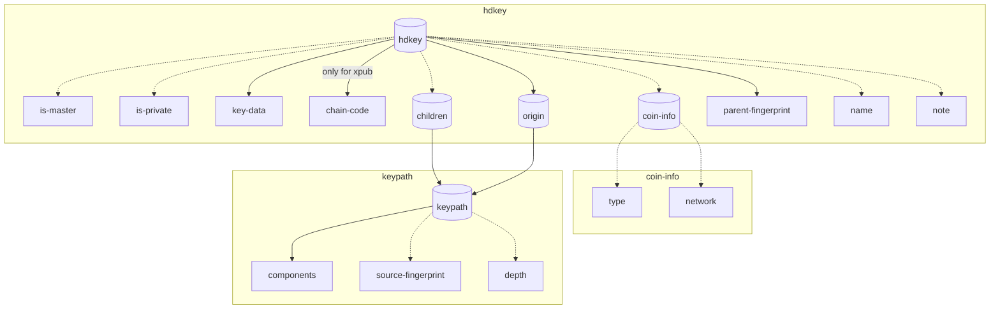
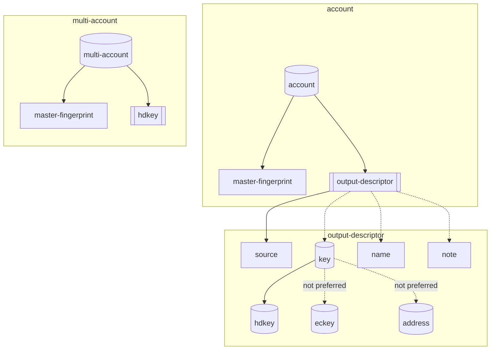
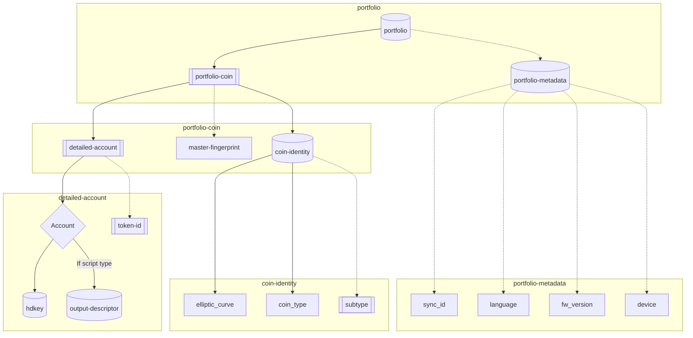

# Sync protocol

## NBCR-2023-002

© 2023 NGRAVE

Authors: Mathieu Da Silva, Irfan Bilaloglu <br/>
Date: April 19, 2023

Revised: October 04, 2024

---

# I - Introduction

The goal of this document is to propose a QR protocol enabling the synchronization of accounts between an offline wallet storing the private keys and a watch-only wallet displaying accounts’ balance and interacting with the blockchain.

The protocol aims to support the synchronization of coins based on several elliptic curves (e.g. Secp256k1 and Ed25519) by sharing all the necessary information for syncing coins ([[BIP44]](https://github.com/bitcoin/bips/blob/master/bip-0044.mediawiki) derivation paths, account level xpubs, etc...), with little user interaction required, only scanning a QR code.

This work is based on existing sync protocols, e.g. [[EIP-4527]](https://eips.ethereum.org/EIPS/eip-4527) to sync EVM accounts between an offline signer and a watch-only wallet. The contribution of this paper relies on the definition of a general-purpose synchronization payload for blockchain-agnostic use. 

## **Definitions**

**Offline signer**: An offline signer is a device or application which holds the user’s private keys and does not have network access.

**Watch-only wallet**: A watch-only wallet is a wallet that has network access and can interact with the blockchain.

## Motivation to use BC-UR types

The BlockchainCommons, referred to as BC, have published a series of data transmission protocol called Uniform Resources (UR). It provides a basic method to encode data into animated QR Codes. The UR have been extended in the [[EIP-4527]](https://eips.ethereum.org/EIPS/eip-4527). The UR types form the basis of the data transmission protocol for the following reasons:

- **Standardization**: a standard already commonly used by other hardware wallets (Keystone, AirGap, CoolWallet, D’Cent).
- **Data compression**: Byte savings using CBOR compared to text encoding.
- **Human-friendly text encoding**: Format is defined as `ur:<type>/<message>` (details can be found [here](https://github.com/BlockchainCommons/Research/blob/master/papers/bcr-2020-005-ur.md))
- **Efficiency of QR code encoding**: data is encoded as CBOR (Concise Binary Object Representation) supporting sizes up to 2^32-1 bytes (~ 4 GB) compared to the largest QR code ("version 40") consisting of 2953 bytes (details can be found in [[BCR-2020-005-UR]](https://github.com/BlockchainCommons/Research/blob/master/papers/bcr-2020-005-ur.md))
- **Time-sequence QR code**: ability to break up messages too large to fit into a QR code into a sequence of QR codes using sophisticated "fountain codes."
- **Error detection**: CRC32 checksum on the entire message in each part to tie them together and ensure the transmitted message has been reconstructed.

## Technical specifications

This document specifies the following limits on the QR code format in order to be able to scan with any devices without requiring the best quality camera.

- The fragment size is fixed at **90 characters** per QR code.
- The time-sequence of QR code is displayed at a fps of **8**.
- The QR code correction level is set to **Medium**.

## Limitation

Despite the generic purpose of this document to standardize a syncing protocol via QR codes, the different blockchains are various and present each their own specificity. We are focusing the sync protocol to support the following blockchains:

- Bitcoin and other PSBT-based blockchains
- Ethereum and other EVM blockchains
- Solana
- Stellar
- MultiversX
- Tezos
- Avalanche X-chain
- XRP Ledger

Any new blockchain should be easily integrated thanks to the blockchain-agnostic communication protocol introduced in this document.

This document focuses only on the synchronization process between the offline signer and the watch-only wallet. The signing protocol via QR codes is detailed in [[NBCR-2023-003]](https://github.com/ngraveio/Research/blob/main/papers/nbcr-2023-003-crypto-sign.md) specification.

---

# II - Sync protocol

The sync protocol follows the described operations:

1) Offline signer provides the account information in a QR code

2) User scans QR code with the watch-only wallet

3) (optional) User selects accounts to sync in watch-only wallet

4) (optional) Watch-only wallet discovers accounts from extended public keys (for coins supporting [[BIP32]](https://github.com/bitcoin/bips/blob/master/bip-0032.mediawiki))

5) Watch-only wallet displays the user portfolio for the synchronized accounts

Based on a set of UR types listed in this document, the sync communication protocol is divided in three layers of communication, as described in Figure 1. The three layers are used depending on the watch-only wallets’ needs. The hardware wallet should be able to generate the sync payload based on the 3 communication layers. 


Figure 1. Illustration of the 3 layers of communication to sync accounts.

The first layer is based on the `hdkey` UR type (#6.40303) proposed by BC in [[BCR-2020-007]](https://github.com/BlockchainCommons/Research/blob/master/papers/bcr-2020-007-hdkey.md) to share a single xpub key with the watch-only wallet. A previous version `crypto-hdkey` (#6.303) differing only with the CBOR tag is deprecated, but may still be supported for backwards compatibility. 

The second layer is based on two UR types: 
1) `account` (#6.40311) proposed by BC in [[BCR-2023-019]](https://github.com/BlockchainCommons/Research/blob/master/papers/bcr-2023-019-account-descriptor.md) to share a list of output descriptors associated to an xpub key (mostly useful to sync with Bitcoin-only wallets). A previous version `crypto-account` (#6.311) defined in [[BCR-2020-015]](https://github.com/BlockchainCommons/Research/blob/master/papers/bcr-2020-015-account.md) is deprecated, but may still be supported for backwards compatibility.
2) `multi-account` (#6.41103), replacing `crypto-multi-account` (#6.1103) introduced by Keystone in [[solana-qr-data-protocol]](https://github.com/KeystoneHQ/Keystone-developer-hub/blob/main/research/solana-qr-data-protocol.md#setup-watch-only-wallet-by-offline-signer) to share multiple public keys with the watch-only wallet (e.g. with coins based on ed25519 curves where each account contains a fully hardened derivation path). The version defined in [[solana-qr-data-protocol]](https://github.com/KeystoneHQ/Keystone-developer-hub/blob/main/research/solana-qr-data-protocol.md#setup-watch-only-wallet-by-offline-signer)  still uses deprecated BCR versions with `crypto-hdkey` (#6.303). We propose in this document the updated version, even if the legacy version may still be supported for backwards compatibility. 

Finally we propose in this document a third layer based on the `portfolio` UR type extended the two other layers to add extra information: 1) by defining a coin identity to specify the elliptic curve and any subtype (e.g. chain ID for EVM chains), 2) by adding token IDs and 3) by sending device-related metadata in the sync payload.

## Sync UR types registry

| Type | [[CBOR Tag]](https://www.iana.org/assignments/cbor-tags/cbor-tags.xhtml) | Owner | Description | Definition |
| --- | --- | --- | --- | --- |
| `hdkey` | 40303 | BlockchainCommons (BC) | Hierarchical Deterministic (HD) key | [[BCR-2020-007]](https://github.com/BlockchainCommons/Research/blob/master/papers/bcr-2020-007-hdkey.md) |
| (Deprecated) `crypto-hdkey` | 303 | BlockchainCommons (BC) | Previous version of Hierarchical Deterministic (HD) key (Only CBOR tag has been updated) | [[BCR-2020-007]](https://github.com/BlockchainCommons/Research/blob/master/papers/bcr-2020-007-hdkey.md) |
| `keypath` | 40304 | BlockchainCommons (BC) | Key Derivation Path | [[BCR-2020-007]](https://github.com/BlockchainCommons/Research/blob/master/papers/bcr-2020-007-hdkey.md) |
| (Deprecated) `crypto-keypath` | 304 | BlockchainCommons (BC) | Previous version of Key Derivation Path (Only CBOR tag has been updated) | [[BCR-2020-007]](https://github.com/BlockchainCommons/Research/blob/master/papers/bcr-2020-007-hdkey.md) |
| `coininfo` | 40305 | BlockchainCommons (BC) | Cryptocurrency Coin Use | [[BCR-2020-007]](https://github.com/BlockchainCommons/Research/blob/master/papers/bcr-2020-007-hdkey.md) |
| (Deprecated) `crypto-coininfo` | 305 | BlockchainCommons (BC) | Previous version of Cryptocurrency Coin Use (Only CBOR tag has been updated) | [[BCR-2020-007]](https://github.com/BlockchainCommons/Research/blob/master/papers/bcr-2020-007-hdkey.md) |
| `output-descriptor` | 40308 | BlockchainCommons (BC) | Output descriptor (Version 3) | [[BCR-2023-010]](https://github.com/BlockchainCommons/Research/blob/master/papers/bcr-2023-010-output-descriptor.md) |
| (Deprecated) `crypto-output` | 308 | BlockchainCommons (BC) | Previous version of Output descriptor (Version 1) | [[BCR-2020-010]](https://github.com/BlockchainCommons/Research/blob/master/papers/bcr-2020-010-output-desc.md) |
| `account` | 40311 | BlockchainCommons (BC) | Import an account based on several output descriptors (Version 2) | [[BCR-2023-019]](https://github.com/BlockchainCommons/Research/blob/master/papers/bcr-2023-019-account-descriptor.md)  |
| (Deprecated) `crypto-account` | 311 | BlockchainCommons (BC) | Previous version of Import an account based on several output descriptors (Version 1) | [[BCR-2020-015]](https://github.com/BlockchainCommons/Research/blob/master/papers/bcr-2020-015-account.md)  |
| `multi-account` | 41103 | Ngrave | Import multiple accounts in one animated QR | This document |
| (Deprecated) `crypto-multi-account` | 1103 | Keystone | Previous version of Import multiple accounts in one animated QR | [[solana-qr-data-protocol]](https://github.com/KeystoneHQ/Keystone-developer-hub/blob/main/research/solana-qr-data-protocol.md#setup-watch-only-wallet-by-offline-signer) |
| `coin-identity` | 41401 | Ngrave | Add additional information to a specific hdkey | [[NBCR-2023-001]](https://github.com/ngraveio/Research/blob/main/papers/nbcr-2023-001-coin-identity.md) |
| `detailed-account` | 41402 | Ngrave | Import multiple accounts with and without output descriptors and specify optionally tokens to synchronize | This document |
| `portfolio-coin` | 41403 | Ngrave | Associate several accounts to its coin identity  | This document |
| `portfolio-metadata` | 41404 | Ngrave | Specify wallet metadata | This document |
| `portfolio` | 41405 | Ngrave | Aggregate the portfolio information | This document |

The table contains deprecated BlockchainCommons UR types that may still be used by some wallets, and therefore should be supported along with the new versions for backward compatibility. In the following document, we will however describe the sync protocol using the latest versions proposed by BlockchainCommons. 

The specification for each UR type contains CBOR structure, expressed in Concise Data Definition Language [[CDDL]](https://datatracker.ietf.org/doc/html/rfc8610). We specify the breakdown of each UR type in this document regarding the legend described in Figure 2.


Figure 2. Legend for UR type breakdown

### UR registry constituting the layer 1

The first layer of the proposed sync protocol is based on `hdkey` UR type. This layer aims to synchronize a single public key for a single coin. The synchronized public key can be an extended public key, referred as xpub, from which the watch-only wallet can derive several addresses. 

 We break down its structure in Figure 3 based on two other UR types: `keypath` and `coininfo`. The CDDL for each UR type is given hereafter.


Figure 3. Breakdown of hdkey composing the layer 1 of the Sync protocol. 

- **CDDL for Key Path** `keypath`

This UR type belongs to the initial registry proposed by BC in [[BCR-2020-007]](https://github.com/BlockchainCommons/Research/blob/master/papers/bcr-2020-007-hdkey.md) and it is used to describe a derivation path `m / purpose' / coin_type' / account' / change / address_index`.

When used embedded in another CBOR structure, this structure should be tagged #6.40304.

```
; Metadata for the complete or partial derivation path of a key.
;
; `source-fingerprint`, if present, is the fingerprint of the
; ancestor key from which the associated key was derived.
;
; If `components` is empty, then `source-fingerprint` MUST be a fingerprint of
; a master key.
;
; `depth`, if present, represents the number of derivation steps in
; the path of the associated key, regardless of whether steps are present in the `components` element
; of this structure.

tagged-keypath = #6.40304(keypath)

keypath = {
    components: [path-component], ; If empty, source-fingerprint MUST be present
    ? source-fingerprint: uint32 .ne 0 ; fingerprint of ancestor key, or master key if components is empty
    ? depth: uint8 ; 0 if this is a public key derived directly from a master key
}

path-component = (
    child-index-component /     ; A single child, possibly hardened
    child-range-component /     ; A specific range of children, all possibly hardened
    child-wildcard-component /  ; An inspecific range of children, all possibly hardened
    child-pair-component        ; Used in output descriptors,
                                ; see https://github.com/bitcoin/bitcoin/pull/22838
)

uint32 = uint .size 4
uint31 = uint32 .lt 0x80000000
child-index-component = (child-index, is-hardened)
child-range-component = ([child-index, child-index], is-hardened) ; [low, high] where low < high
child-wildcard-component = ([], is-hardened)
child-pair-component = [
    child-index-component,  ; Child to use for external addresses, possibly hardened
    child-index-component   ; Child to use for internal addresses, possibly hardened
]

child-index = uint31
is-hardened = bool

components = 1
source-fingerprint = 2
depth = 3
```

- **CDDL for Coin Info** `coininfo`

This UR type belongs to the initial registry proposed by BC in [[BCR-2020-007]](https://github.com/BlockchainCommons/Research/blob/master/papers/bcr-2020-007-hdkey.md) and it is used to describe the SLIP44 and the network (mainnet or testnet) of a coin.

When used embedded in another CBOR structure, this structure should be tagged #6.40305.

```
; Metadata for the type and use of a cryptocurrency

tagged-coininfo = #6.40305(coininfo)

coininfo = {
    ? type: uint31 .default cointype-btc, ; values from [SLIP44](https://github.com/satoshilabs/slips/blob/master/slip-0044.md) with high bit turned off
    ? network: int .default mainnet ; coin-specific identifier for testnet
}

type = 1
network = 2

cointype-btc = 0
cointype-eth = 0x3c

mainnet = 0;
testnet-btc = 1;

; from [ETH-TEST-NETWORKS]
testnet-eth-ropsten = 1;
testnet-eth-kovan = 2;
testnet-eth-rinkeby = 3;
testnet-eth-gorli = 4;
```

- **CDDL for HDKey** `hdkey`

This UR type belongs to the initial registry proposed by BC in [[BCR-2020-007]](https://github.com/BlockchainCommons/Research/blob/master/papers/bcr-2020-007-hdkey.md) and it is used to share a public key with its derivation paths.

When used embedded in another CBOR structure, this structure should be tagged #6.40303.

```
tagged-hdkey = #6.40303(hdkey)

; An HD key is either a master key or a derived key.

hdkey = {
    master-key / derived-key
}

; A master key is always private, has no use or derivation information,
; and always includes a chain code.
master-key = (
    is-master: true,
    key-data: key-data-bytes,
    chain-code: chain-code-bytes
)

; A derived key may be private or public, has an optional chain code, and
; may carry additional metadata about its use and derivation.
; To maintain isomorphism with [BIP32] and allow keys to be derived from
; this key `chain-code`, `origin`, and `parent-fingerprint` must be present.
; If `origin` contains only a single derivation step and also contains `source-fingerprint`,
; then `parent-fingerprint` MUST be identical to `source-fingerprint` or may be omitted.
derived-key = (
    ? is-private: bool .default false,     ; true if key is private, false if public
    key-data: key-data-bytes,
    ? chain-code: chain-code-bytes         ; omit if no further keys may be derived from this key
    ? use-info: tagged-coininfo, ; How the key is to be used
    ? origin: tagged-keypath,    ; How the key was derived
    ? children: tagged-keypath,  ; What children should/can be derived from this
    ? parent-fingerprint: uint32 .ne 0,    ; The fingerprint of this key's direct ancestor, per [BIP32]
    ? name: text,                          ; A short name for this key.
    ? note: text                           ; An arbitrary amount of text describing the key.
)

; If the `use-info` field is omitted, defaults (mainnet BTC key) are assumed.
; If `cointype` and `origin` are both present, then per [BIP44], the second path
; component's `child-index` must match `cointype`.

; The `children` field may be used to specify what set of child keys should or can be derived from this key. This may include `child-index-range` or `child-index-wildcard` as its last component. Any components that specify hardened derivation will require the key be private.

is-master = 1
is-private = 2
key-data = 3
chain-code = 4
use-info = 5
origin = 6
children = 7
parent-fingerprint = 8
name = 9
note = 10

uint8 = uint .size 1
key-data-bytes = bytes .size 33
chain-code-bytes = bytes .size 32
```

### UR registry constituting the layer 2

The second layer of the proposed sync protocol is based on `multi-account` and `account` UR types, wrapping as lists `hdkey` and `output-descriptor` respectively. 

When using `multi-account`, this layer aims to synchronize several public keys for the same coin. While when using `account`, this layer aims to add script types for each synchronized public key.

The CDDL for version 1 `crypto-multi-account` differs from version 2 `multi-account` only in the UR types and CBOR tags it uses, respectively `#6.1103` for version 1 and `#6.41103` for version 2.

We break down the structures of `multi-account` and `account` in Figure 4. The CDDL for the other UR types are given hereafter.


Figure 4. Breakdown of multi-account and account forming the layer 2 of the Sync protocol

- **CDDL for output descriptor** `output-descriptor`

This UR type belongs to the initial registry proposed by BC in [[BCR-2023-010]](https://github.com/BlockchainCommons/Research/blob/master/papers/bcr-2023-010-output-descriptor.md) to describe the association of a standardized script types with a public key. You can refer to [[BCR-2020-010]](https://github.com/BlockchainCommons/Research/blob/master/papers/bcr-2020-010-output-desc.md) for the description of the previous version `crypto-output` not detailed in this document, but still supported for backward compatibility.

When used embedded in another CBOR structure, this structure should be tagged #6.40308.

```
output-descriptor = #6.40308(
    {
        source: text,       ; text descriptor with keys replaced by placeholders
        ? keys: [+key], ; array of keys corresponding to placeholders, omitted if source is a complete text descriptor with no placeholders
        ? name: text,       ; optional user-assigned name
        ? note: text        ; optional user-assigned note
    }
)

source = 1
keys = 2
name = 3
note = 4

key = (
    hd-key /    ; BCR-2020-007
    ec-key /    ; BCR-2020-008
    address     ; BCR-2020-009
)
```

In the proposed sync protocol, the recommendation when using an output descriptor is to prefer using `hdkey` instead of `eckey` and `address` UR types, since both `eckey` and `address` as described respectively in [[BCR-2020-008]](https://github.com/BlockchainCommons/Research/blob/master/papers/bcr-2020-008-eckey.md) and [[BCR-2020-009]](https://github.com/BlockchainCommons/Research/blob/master/papers/bcr-2020-009-address.md) do not contain information related to the derivation path, essential information to identify an account.

- **CDDL for syncing several accounts with their output descriptors** `account`

This UR type belongs to the initial registry proposed by BC in [[BCR-2023-019]](https://github.com/BlockchainCommons/Research/blob/master/papers/bcr-2023-019-account-descriptor.md) and is used to synchronize a number of accounts defined with their public keys and derivation paths along with their associated standardized script types.

The following script types can be encoded within `account` UR type. We give the default derivation path for Bitcoin mainnet and account #0:

| Script type | Default Derivation |
| --- | --- |
| P2PKH | m/44'/0'/0' |
| P2SH-P2WPKH | m/49'/0'/0' |
| P2WPKH | m/84'/0'/0' |
| Multisig cosigner P2SH | m/45' |
| Multisig cosigner P2SH-P2WSH | m/48'/0'/0'/1' |
| Multisig cosigner P2WSH | m/48'/0'/0'/2' |
| Single key P2TR | m/86'/0'/0' |

When used embedded in another CBOR structure, this structure should be tagged #6.40311.

```
; Output descriptors here are restricted to HD keys at account level key derivations only (no 0/* or 1/* children keypaths)

output-exp = #6.40308(output-descriptor)

tagged-account = #6.40311(account)

account = {
    master-fingerprint: uint32, ; Master fingerprint (fingerprint for the master public key as per BIP32)
    output-descriptors: [+ output-exp] ; Output descriptors for various script types for this account
}

master-fingerprint = 1
output-descriptors = 2
```

- **CDDL for syncing multiple accounts without their output descriptors** `multi-account`

A first version of this UR type has been added to the initial registry by keystone in [[solana-qr-data-protocol]](https://github.com/KeystoneHQ/Keystone-developer-hub/blob/main/research/solana-qr-data-protocol.md#setup-watch-only-wallet-by-offline-signer) in order to be able to send multiple `crypto-hdkey` describing several accounts of the same coin.

We propose an updated version `multi-account` using the updated version `hdkey`.

When used embedded in another CBOR structure, this structure should be tagged #6.41103.

```
key_exp = #6.4303(hdkey)

accounts = {
    master-fingerprint: uint32, ; Master fingerprint (fingerprint for the master public key as per BIP32)
    keys: [+ key_exp],          ; Different account keys for a offline signer.
    ? device: string            ; Indicates the origin of these accounts, e.g. 'Keystone'
}

master-fingerprint = 1
keys = 2
device = 3
```

### UR registry constituting the layer 3

The third layer of the proposed sync protocol is based on `portfolio` UR type, aiming to synchronize the accounts related to multiple coins.

We break down its structure in Figure 5 based on newly defined UR types: `portfolio-coin`, `coin-identity`, `detailed-account` and `portfolio-metadata`. The CDDL for the new UR types are given hereafter.


Figure 5. Breakdown of portfolio forming the layer 3 of the sync protocol

- **CDDL for synchronizing several accounts with detailed information** `detailed-account`

In this document, we are defining the new `detailed-account` UR type, extending the scope of the previously defined `account` and `multi-account` UR types in [UR registry constituting the layer 2](nbcr-2023-002-multi-layer-sync.md#ur-registry-constituting-the-layer-2). The information contained in the layer 2 sync protocol can be easily converted to `detailed-account` type.

This new type aims to incorporate in the same structure:

- The accounts with and without scripts by selecting either `hdkey` or `output-descriptor`. When a `hdkey` is embedded inside `detailed-account`, the optional `coin-info` in `hdkey` should **not** be defined since `detailed-account` is used in combination with `coin-identity` used already as asset identifier. 
- An optional list of tokens to synchronize them at the same time of the associated account. A token identifier is defined either as a string or as bytes.

The following specification of `detailed-account` is written in CDDL. When used embedded in another CBOR structure, this structure should be tagged #6.41402.

```
account_exp = #6.40303(hdkey) / #6.40308(output-descriptor)

; Accounts are specified using either '#6.40303(hdkey)' or 
; '#6.40308(output-descriptor)'.
; By default, '#6.40303(hdkey)' should be used to share public keys and
; extended public keys.
; '#6.308(output-descriptor)' should be used to share an output descriptor, 
; e.g. for the different Bitcoin address formats (P2PKH, P2SH-P2WPKH, P2WPKH, P2TR).

; Optional 'token-ids' to indicate the synchronization of a list of tokens with
; the associated accounts
; 'token-id' is defined differently depending on the blockchain:
; - ERC20 tokens on EVM chains are identified by their contract addresses 
; (e.g. `0xA0b86991c6218b36c1d19D4a2e9Eb0cE3606eB48`)
; - ERC1155 tokens are identifed with their contract addresses followed by their 
; ID with ':' as separator (e.g. `0xfaafdc07907ff5120a76b34b731b278c38d6043c:
; 508851954656174721695133294256171964208`)
; - ESDT tokens on MultiversX are by their name followed by their ID with `-` as 
; separator (e.g. `USDC-c76f1f`)
; - SPL tokens on Solana are identified by their contract addresses
; (e.g. `EPjFWdd5AufqSSqeM2qN1xzybapC8G4wEGGkZwyTDt1v`)

detailed-account = { 
  account: account_exp,
  ? token-ids: [+ string / bytes] ; Specify multiple tokens associated to one account
}

account = 1
token-ids = 2
```

- **CDDL for synchronizing accounts with their coin identity** `portfolio-coin`

In this document, we are defining the new `portfolio-coin` UR type associating the `coin-identity` defined in [[NBCR-2023-001]](https://github.com/ngraveio/Research/blob/main/papers/nbcr-2023-001-coin-identity.md) with their accounts. The accounts are preferably defined using a list of `detailed-account`. 

To keep full compatibility with the layer 2, the accounts can also be specified using `account` and `crypto-multi-account` UR types. Using these UR types will however limit the information which can be synchronized.

The following specification of `portfolio-coin` is written in CDDL. When used embedded in another CBOR structure, this structure should be tagged #6.41403.

```
; Associate a coin identity to its accounts

detailed_accounts = [+ #6.41402(detailed-account)]

; The accounts are listed using #6.41402(detailed-account) to share the maximum of information related to the accounts

coin = {
  coin-id: #6.41401(coin-identity),
  accounts: accounts_exp,
  ? master-fingerprint: uint32 ; Master fingerprint (fingerprint for the master public key as per BIP32)
}

; master-fingerprint must match the potential other fingerprints included in the other sub-UR types

coin-id = 1
accounts = 2
```

- **CDDL for syncing metadata** `portfolio-metadata`

In this document, we are defining the new `portfolio-metadata` UR type to include device metadata related to the offline signer.

In many QR-based offline signer, the synchronization payload includes metadata information related to the device. We have created a general purpose UR type to include such information.

When used embedded in another CBOR structure, this structure should be tagged #6.41404.

```
metadata = {
		? sync_id: bytes .size 16     ; Generated by the hardware wallet to identify 
the device
		? language: language_code,    ; Indicates the selected language 
on the hardware wallet
		? fw_version: string,         ; Firmware version of the hardware wallet
		? device: string              ; Indicates the device name
}

sync_id = 1
language = 2
fw_version = 3
device = 4

language_code = string ; following [ISO 639-1] Code (e.g. "en" for English, 
"fr" for French, "nl" for Dutch and "es" for Spanish
```

The language is encoded with alpha-2 code to represent the names of the language following [[ISO 639-1]](https://www.iso.org/standard/22109.html).

- **CDDL for syncing the general purpose payload** `portfolio`

In this document, we are defining the new UR type `portfolio` to aggregate accounts, coin identity and metadata information together.

When used embedded in another CBOR structure, this structure should be tagged #6.41405.

```
; Top level multi coin sync payload

sync = {
		coins: [+ #6.41403(portfolio-coin)],           ; Multiple coins with their respective accounts and coin identities
		? metadata: #6.41404(portfolio-metadata) ; Optional wallet metadata
}

coins = 1
metadata = 2
```

## Sync communication layers

The online watch-only wallet has different needs regarding the information needed to be synced from the hardware wallet. Depending on the needs, the sync protocol will create a payload based on 3 layers:

1) Sync the accounts of a single coin by sharing a single extended public key and his derivation path using `hdkey` UR type (e.g. an Ethereum xpub with Metamask as watch-only wallet).

2) Sync the accounts of a single coin when additional information are required:

   a. The accounts are defined with different output descriptors using `account` UR type (e.g. syncing Bitcoin accounts with BTC-only watch-only wallet).     
   b. The accounts of the same coin are defined by several public keys and different derivation paths using `crypto-multi-accounts` UR type (e.g. syncing Solana accounts with Solflare wallet as watch-only wallet). 

3) Sync the accounts of multiple coins identified with their coin identity, along with optional tokens information and device-related metadata, using `portfolio` UR type (e.g. syncing any coin and token between NGRAVE ZERO offline signer and NGRAVE LIQUID watch-only wallet).

### 1) Sync a single coin based on a unique extended public key (Metamask case)

In the first layer of the sync protocol, the watch-only wallet requires only to receive the extended public key in [[BIP32]](https://github.com/bitcoin/bips/blob/master/bip-0032.mediawiki) format along with the derivation path in [[BIP44]](https://github.com/bitcoin/bips/blob/master/bip-0044.mediawiki) format, contained in `hdkey` UR type.  

The watch-only wallet is able to derive and to synchronize the different accounts associated to the extended public key.

The first layer is privileged when the watch-only wallet requires only the synchronization of a single coin with its extended public key, e.g. Metamask with an ETH xpub to derive the accounts for all the EVM-compatible blockchains. 

**Use case**

The offline signer creates a sync payload containing the mandatory following fields:

- Key data
- Chain code
- Origin derivation path containing the hardened derivation path of the xpub (e.g. `m/44’/60’/0’`)
- Parent fingerprint

The watch-only wallet reconstructs the xpub and proposes to the user the derived accounts. 

**Example**

An example illustrates how the sync payload is formed using the first layer of communication:

<details>

<summary>Layer 1 example from [BCR-2020-007] for syncing ETH xpub `m/44’/60’/0’`</summary>

- XPUB:
    
```
xpub6CRQif2S43vtEYf5cZdMhrFpuBFkgFkALM6qhJZz7ws2cfEf1f8Jiv8dXSkizobckHyfH1mFDFZn46AJoh8d4FpB6ydFFg49yPkJF69GsHq
```
- Decoded from Base58
``` 
0488b21e0368b6e8a8800000001d710954e58073f927f283c61bc1428ac30a3d86d04dacb3a78613401f7818390204fa032947600aae94a889dfc31b5c96afcb7f7e23a189114b71e0254c4b88b5b6d9d2d0
```
- Separated into fields specified in [BIP32] 
```
04 ; version 4
88b21e ; `xpub`
03 ; depth 3 == number of derivation steps in the patch of the associated key
68b6e8a8 ; parent fingerprint == the fingerprint of the ancestor key from which the associated key was derived.
80000000 ; child number
1d710954e58073f927f283c61bc1428ac30a3d86d04dacb3a78613401f781839 ; chain code
0204fa032947600aae94a889dfc31b5c96afcb7f7e23a189114b71e0254c4b88b5 ; key data
b6d9d2d0 ; base58 checksum
``` 
- CBOR encoding (see [playground](https://cbor.me/?diag=5D90131A1020006D90130A20186182CF5183CF500F5021A68B6E8A8081A68B6E8A809664E4752415645)) 
```
A7                                      # map(7)
01                                   # unsigned(1) is-master
F4                                   # primitive(20) false
03                                   # unsigned(3) key-data
58 21                                # bytes(33)
  0204FA032947600AAE94A889DFC31B5C96AFCB7F7E23A189114B71E0254C4B88B5
04                                   # unsigned(4) chain-code
58 20                                # bytes(32) 
  1D710954E58073F927F283C61BC1428AC30A3D86D04DACB3A78613401F781839 
05                                   # unsigned(5) use-info
D9 9D71                              # tag(40305) #6.40305(coininfo)
  A1                                # map(1)
     02                             # unsigned(2) network
     00                             # unsigned(0) mainnet
06                                   # unsigned(6) origin
D9 9D70                              # tag(40304) #6.40304(keypath)
  A2                                # map(2) 
     01                             # unsigned(1) derivation path
     86                             # array(6)
	18 2C                       # unsigned(44) 44
	F5                          # primitive(21) true
	18 3C                       # unsigned(60) 60
	F5                          # primitive(21) true
	00                          # unsigned(0) 0
	F5                          # primitive(21) true
     02                             # unsigned(2) source-fingerprint
     1A 68B6E8A8                    # unsigned(1756817576)
08                                   # unsigned(8) parent-fingerprint
1A 68B6E8A8                          # unsigned(1756817576)
09                                   # unsigned(9) name
66                                   # text(6)
  4E4752415645                      # "NGRAVE"
```
- UR encoding
```
ur:crypto-hdkey/osadwkaxhdclaoaazsaxdtflhnbkplmwpdldursrcwhhmtpesblbkbcnoyldbygrjsvtdagsgrloreaahdcxcajsasghvwlajkytdiwzlsswcwsefwlesrbkfslntigtpsqdoslnbwfzctkscsesahtantjsoyaoaeamtantjooeadlncsdwykcsfnykaeykaocyisrpvspdaycyisrpvspdasiyglflgmfphfferttovymh
```

</details> 

### 2.a) Sync a single coin along with output descriptors (Sparrow wallet case)

In the first case of the second layer of the sync protocol, the watch-only wallet requires to receive output descriptors with the coin information. This case includes the coins as Bitcoin where a script type is specified in addition of an extended public key, both information are contained in `account` UR type.

The first case of the second layer is privileged with a watch-only wallet synchronizing only coins based on script types, e.g. Sparrow wallet with Bitcoin accounts.

**Use case**

The offline signer creates a sync payload containing the mandatory following fields:

- Master fingerprint
- List of output descriptors
    - Script type (e.g. multisig, taproot)
    - Key data
    - Chain code
    - Origin derivation path containing the hardened derivation path of the xpub (e.g. `m/44’/0’/0’`)
    - Parent fingerprint

The watch-only wallet reconstructs the xpub for each derivation path and script type and proposes to the user the derived accounts. 

An example for the layer 2.a can be found in [BCR-2023-019] for syncing BTC accounts.

### 2.b) Sync a single coin based on multiple public keys (Solflare case)

In the second case of the second layer of the sync protocol, the watch-only requires to receive the coin information with a public key for each account. This case includes the coins based on ed25519 curve where their derivation paths are fully hardened, and therefore the use of `crypto-hdkey` alone is not possible. The `crypto-multi-accounts` UR type is preferred to embed an array of `crypto-hdkey` UR type, corresponding to each full hardened derivation path with its public key.

The second case of the second layer is privileged with a watch-only wallet synchronizing only coins based on ed25519 curve, e.g. Solflare with Solana accounts. 

**Use case**

The offline signer creates a sync payload containing the mandatory following fields:

- Master fingerprint
- List of shared accounts
    - Key data
    - Chain code
    - Origin derivation path, containing the full hardened path of the address for ed25519 coins (e.g. `m/44’/501’/0’/0’`)
    - Parent fingerprint

The watch-only wallet reconstructs:

- The public addresses derived from the full hardened path for ed25519 coins.

**Examples**

Several examples illustrate how the sync payload is formed using the second layer of communication:

<details>

<summary>Layer 2.b example for syncing SOL account #0</summary>

- Public key derived following SLIP-044:
    
```
GovgcGs4SvM7SdkDHdh5Y7WTLfYa3NBt4dhSKfgkF3R4
```

- Decoded from Base58 and compressed public key:

```
02EAE4B876A8696134B868F88CC2F51F715F2DBEDB7446B8E6EDF3D4541C4EB67B
```

- CBOR diagnosis format:

```
{1: 934670036, ; master-fingerprint
 2: [40303(  ; #6.40303(hdkey)
  {3: h'02EAE4B876A8696134B868F88CC2F51F715F2DBEDB7446B8E6EDF3D4541C4EB67B', ; key-data
   6: 304({1: [44, true, 501, true, 0, true, 0, true]}) ; origin m/44’/501’/0’/0’
 })],
 3: "NGRAVE"
}
```

- CBOR encoding

```
A3                                      # map(3)
   01                                   # unsigned(1)
   1A 37B5EED4                          # unsigned(934670036)
   02                                   # unsigned(2)
   81                                   # array(1)
      D9 9D6F                           # tag(40303)
         A2                             # map(2)
            03                          # unsigned(3)
            58 21                       # bytes(33)
               02EAE4B876A8696134B868F88CC2F51F715F2DBEDB7446B8E6EDF3D4541C4EB67B 
            06                          # unsigned(6)
            D9 0130                     # tag(304)
               A1                       # map(1)
                  01                    # unsigned(1)
                  88                    # array(8)
                     18 2C              # unsigned(44)
                     F5                 # primitive(21)
                     19 01F5            # unsigned(501)
                     F5                 # primitive(21)
                     00                 # unsigned(0)
                     F5                 # primitive(21)
                     00                 # unsigned(0)
                     F5                 # primitive(21)
   03                                   # unsigned(3)
   66                                   # text(6)
      4E4752415645                      # "NGRAVE"
```

- UR encoding 

```
ur:crypto-multi-accounts/otadcyemrewytyaolytantjloeaxhdclaowdverokopdinhseeroisyalksaykctjshedprnuyjyfgrovawewftyghceglrpkgamtaaddyoyadlocsdwykcfadykykaeykaeykaxiyglflgmfphffehpdiytlf
```

</details>

<details>

<summary>Layer 2.b example for syncing EGLD account #0 and #1</summary>
    
- Public addresses following SLIP-044:

```
erd1j4rksg3mh9qp2dgyv2ad5gx6amt7yhz8wlue0dtvqfm5de8c43ns5n8c6y ; m/44’/508’/0’/0’/0’
erd1gymuz6ukd2avrh6vhzf67ss75zlxrffzv648kw4fjwgq7ufevs8s463da3 ; m/44’/508’/0’/0’/1’
```

- Decoded from Bech32 and compressed public key:

```
02954768223BB94015350462BADA20DAEED7E25C4777F997B56C027746E4F8AC67 ; m/44’/508’/0’/0’/0’
024137C16B966ABAC1DF4CB893AF421EA0BE61A52266AA7B3AA993900F7139640F ; m/44’/508’/0’/0’/1’
```

- CBOR diagnosis format:

```
{1: 934670036, ; master-fingerprint
 2: [40303(  ; #6.40303(hdkey)
  {3: h'02954768223BB94015350462BADA20DAEED7E25C4777F997B56C027746E4F8AC67', ; key-data
   6: 304({1: [44, true, 508, true, 0, true, 0, true, 0, true]}) ; origin m/44’/501’/0’/0’/0'
 }),
 40303(  ; #6.40303(hdkey)
  {3: h'024137C16B966ABAC1DF4CB893AF421EA0BE61A52266AA7B3AA993900F7139640F', ; key-data
   6: 304({1: [44, true, 508, true, 0, true, 0, true, 1, true]}) ; origin m/44’/501’/0’/0’/1'
 })],
 3: "NGRAVE"
}
```

- CBOR encoding

```
A3                                      # map(3)
   01                                   # unsigned(1)
   1A 37B5EED4                          # unsigned(934670036)
   02                                   # unsigned(2)
   82                                   # array(2)
      D9 9D6F                           # tag(40303)
         A2                             # map(2)
            03                          # unsigned(3)
            58 21                       # bytes(33)
               02954768223BB94015350462BADA20DAEED7E25C4777F997B56C027746E4F8AC67 
            06                          # unsigned(6)
            D9 0130                     # tag(304)
               A1                       # map(1)
                  01                    # unsigned(1)
                  8A                    # array(10)
                     18 2C              # unsigned(44)
                     F5                 # primitive(21)
                     19 01FC            # unsigned(508)
                     F5                 # primitive(21)
                     00                 # unsigned(0)
                     F5                 # primitive(21)
                     00                 # unsigned(0)
                     F5                 # primitive(21)
                     00                 # unsigned(0)
                     F5                 # primitive(21)
      D9 9D6F                           # tag(40303)
         A2                             # map(2)
            03                          # unsigned(3)
            58 21                       # bytes(33)
               024137C16B966ABAC1DF4CB893AF421EA0BE61A52266AA7B3AA993900F7139640F 
            06                          # unsigned(6)
            D9 0130                     # tag(304)
               A1                       # map(1)
                  01                    # unsigned(1)
                  8A                    # array(10)
                     18 2C              # unsigned(44)
                     F5                 # primitive(21)
                     19 01FC            # unsigned(508)
                     F5                 # primitive(21)
                     00                 # unsigned(0)
                     F5                 # primitive(21)
                     00                 # unsigned(0)
                     F5                 # primitive(21)
                     01                 # unsigned(1)
                     F5                 # primitive(21)
   03                                   # unsigned(3)
   66                                   # text(6)
      4E4752415645                      # "NGRAVE"
```

- UR encoding 
```
ur:crypto-multi-accounts/otadcyemrewytyaolftantjloeaxhdclaomdfliscpfrrhfzbzecaaidrdtncxtnwytsvohhflktytmsrejzaoktfgveyapsioamtaaddyoyadlecsdwykcfadztykaeykaeykaeyktantjloeaxhdclaofpemsejemtimrdseurgsromupefwcknbrnhsoncpiypkkgftptmumhbsjsesiebsamtaaddyoyadlecsdwykcfadztykaeykaeykadykaxiyglflgmfphffegdgwiafm
```

</details>

### 3) Sync multiple coins with their coin identifier (NGRAVE case)

Compared to the first and second layers of the sync protocol, the third layer is made for every watch-only wallets aiming to support any coins, representing the generic case how NGRAVE ZERO offline signer and NGRAVE LIQUID app are functioning. The `portfolio` UR type includes multiple coins/blockchains based on different elliptic curves. 

The accounts of each coin are described using a list of `detailed-account` indicating a public key or extended public key, a derivation path, a potential script type and a potential list of tokens associated to the account.

The accounts are always grouped under a coin identity with the `coin-identity` UR type.

Additionally, the offline signer can send metadata in `portfolio-metadata` along with the coins and the accounts.

**Use case**

The offline signer creates a sync payload containing the mandatory following fields:

- Coin identity for each coin added in the user portfolio
- Accounts associated to the coin identity, including the following information:
    - Extended public key intended for watch only wallet to discover addresses from
    - Accounts using specific type script
    - List of public keys in case of fully hardened derivation paths

The watch-only wallet synchronize the following information by:

- Getting the coin logo and price from the coin identity
- Selecting the protocol to use from the coin identity
- Discovering addresses from the supplied extended public key in accounts information
- Setting script types from accounts information
- Generating addresses from the list of public keys in accounts information

Additionally, the offline signer can add the optional fields in the sync payload:

- Device metadata composed of:
    - Sync ID
    - Language
    - Firmware version
    - Device name
- List of tokens to synchronize with each account

The watch-only wallet can process these optional information if he wants to by:

- Identifying the device and setting up the language accordingly
- Displaying the tokens information supplied by the offline signer for each account

**Example**

An example illustrates how the sync payload is formed using the third layer of communication:

<details>

<summary>Layer 3 example for syncing ETH, SOL, MATIC with their respective USDC token</summary>

- CBOR diagnosis format

```
{
 1: [ 41403( ; #6.41403(portfolio-coin)
   {1: 41401( ; #6.41401(coin-identity)
        {1: 8, ; secp256k1 curve
         2: 60, ; Ethereum BIP44
         3: [ 1 ] ; Ethereum chain ID
        }),
    2: [41402( ; #6.41402(detailed-account)
        {1: 40303( ; #6.40303(hdkey)
           {3: h'032503D7DCA4FF0594F0404D56188542A18D8E0784443134C716178BC1819C3DD4', ; key-data
            4: h'719EA8CADCA1BBC71BF8511AC3A487286B4D34A860007B8FD498F2732EB89906', ; chain-code
            6: 40304({1: [44, true, 60, true, 0, true]}), ; origin m/44'/60'/0'
            7: 40304({1: [0, false, [0, 1], false]}) ; children m/44'/60'/0'/0/0 and m/44'/60'/0'/0/1
          }),
        2: [ h'A0b86991c6218b36c1d19D4a2e9Eb0cE3606eB48' ]  ; USDC ERC20 token on Ethereum 
       })]
   }),
   41403( ; #6.41403(portfolio-coin) 
   {1: 41401( ; #6.41401(coin-identity)
        {1: 6, ; ed25519 curve
         2: 501 ; Solana BIP44
        }),
    2: [41402( ; #6.41402(detailed-account)
        {1: 40303(  ; #6.40303(hdkey)
           {3: h'02EAE4B876A8696134B868F88CC2F51F715F2DBEDB7446B8E6EDF3D4541C4EB67B', ; key-data
            6: 304({1: [44, true, 501, true, 0, true, 0, true]}) ; origin m/44’/501’/0’/0’
          }),
        2: [ "EPjFWdd5AufqSSqeM2qN1xzybapC8G4wEGGkZwyTDt1v" ] ; USDC SPL token
       }),
	   41402( ; #6.41402(detailed-account)
        {1: 40303(  ; #6.40303(hdkey)
           {3: h'0260563EE80C26844621B06B74070BAF0E23FB76CE439D0237E87502EBBD3CA346', ; key-data
            6: 40304({1: [44, true, 501, true, 0, true, 1, true]}) ; origin m/44’/501’/0’/1’
          })
       })]
   }),
   41403( ; #6.41403(portfolio-coin)
   {1: 41401( ; #6.41401(coin-identity)
        {1: 8, ; secp256k1 curve
         2: 60, ; Ethereum BIP44
         3: [ 137 ] ; Polygon chain ID
        }),
    2: [41402( ; #6.41402(detailed-account)
        {1: 40303(  ; #6.40303(hdkey)
           {3: h'032503D7DCA4FF0594F0404D56188542A18D8E0784443134C716178BC1819C3DD4', ; key-data
            4: h'719EA8CADCA1BBC71BF8511AC3A487286B4D34A860007B8FD498F2732EB89906', ; chain-code
            6: 40304({1: [44, true, 60, true, 0, true]}), ; origin m/44'/60'/0'
            7: 40304({1: [0, false, [0, 2], false]}) ; children m/44'/60'/0'/0/0, m/44'/60'/0'/0/1 and m/44'/60'/0'/0/2
          }),
        2: [ h'2791Bca1f2de4661ED88A30C99A7a9449Aa84174' ] ; USDC ERC20 token on Polygon 
       })]
   }),
   41403( ; #6.41403(portfolio-coin)
   {1: 41401( ; #6.41401(coin-identity)
        {1: 8, ; secp256k1 curve
         2: 0 ; Bitcoin BIP44
        }),
    2: [41402( ; #6.41402(detailed-account)
         {1: 40308({ ; output-descriptor
            1: "pkh(@0)", ; source (text descriptor)
            2: [ ; keys array
               40303({ ; hdkey
                  3: h'03EB3E2863911826374DE86C231A4B76F0B89DFA174AFB78D7F478199884D9DD32', ; key-data
                  4: h'6456A5DF2DB0F6D9AF72B2A1AF4B25F45200ED6FCC29C3440B311D4796B70B5B', ; chain-code
                  6: 40304({1: [44, true, 0, true, 0, true]}) ; origin 44'/0'/0'
            })]	 
	     })}),
         41402( ; #6.441402(detailed-account)
         {1: 40308({ ; output-descriptor
            1: "sh(wpkh(@0))", ; source (text descriptor)
            2: [ ; keys array
               40303({ ; hdkey
                  3: h'02C7E4823730F6EE2CF864E2C352060A88E60B51A84E89E4C8C75EC22590AD6B69', ; key-data
                  4: h'9D2F86043276F9251A4A4F577166A5ABEB16B6EC61E226B5B8FA11038BFDA42D', ; chain-code
                  6: 40304({1: [49, true, 0, true, 1, true]}) ; origin 49'/0'/1'
            })]  
          })}
	   )]
    })
 ],
 2: 41404( ; #6.41404(crypto-metadata)
   {1: 934670036, ; master-fingerprint
    2: "en", ; language
    3: "1.7-2.rc", ; version
    4: "NGRAVE" ; device
   })
}
```

- CBOR encoding 

```
A2                                      # map(2)
   01                                   # unsigned(1)
   84                                   # array(4)
      D9 A1BB                           # tag(41403)
         A2                             # map(2)
            01                          # unsigned(1)
            D9 A1B9                     # tag(41401)
               A3                       # map(3)
                  01                    # unsigned(1)
                  08                    # unsigned(8)
                  02                    # unsigned(2)
                  18 3C                 # unsigned(60)
                  03                    # unsigned(3)
                  81                    # array(1)
                     01                 # unsigned(1)
            02                          # unsigned(2)
            81                          # array(1)
               D9 A1BA                  # tag(41402)
                  A2                    # map(2)
                     01                 # unsigned(1)
                     D9 9D6F            # tag(40303)
                        A4              # map(4)
                           03           # unsigned(3)
                           58 21        # bytes(33)
                              032503D7DCA4FF0594F0404D56188542A18D8E0784443134C716178BC1819C3DD4 
                           04           # unsigned(4)
                           58 20        # bytes(32)
                              719EA8CADCA1BBC71BF8511AC3A487286B4D34A860007B8FD498F2732EB89906 
                           06           # unsigned(6)
                           D9 9D70      # tag(40304)
                              A1        # map(1)
                                 01     # unsigned(1)
                                 86     # array(6)
                                    18 2C # unsigned(44)
                                    F5  # primitive(21)
                                    18 3C # unsigned(60)
                                    F5  # primitive(21)
                                    00  # unsigned(0)
                                    F5  # primitive(21)
                           07           # unsigned(7)
                           D9 9D70      # tag(40304)
                              A1        # map(1)
                                 01     # unsigned(1)
                                 84     # array(4)
                                    00  # unsigned(0)
                                    F4  # primitive(20)
                                    82  # array(2)
                                       00 # unsigned(0)
                                       01 # unsigned(1)
                                    F4  # primitive(20)
                     02                 # unsigned(2)
                     81                 # array(1)
                        54              # bytes(20)
                           A0B86991C6218B36C1D19D4A2E9EB0CE3606EB48 
      D9 A1BB                           # tag(41403)
         A2                             # map(2)
            01                          # unsigned(1)
            D9 A1B9                     # tag(41401)
               A2                       # map(2)
                  01                    # unsigned(1)
                  06                    # unsigned(6)
                  02                    # unsigned(2)
                  19 01F5               # unsigned(501)
            02                          # unsigned(2)
            82                          # array(2)
               D9 A1BA                  # tag(41402)
                  A2                    # map(2)
                     01                 # unsigned(1)
                     D9 9D6F            # tag(40303)
                        A2              # map(2)
                           03           # unsigned(3)
                           58 21        # bytes(33)
                              02EAE4B876A8696134B868F88CC2F51F715F2DBEDB7446B8E6EDF3D4541C4EB67B 
                           06           # unsigned(6)
                           D9 0130      # tag(304)
                              A1        # map(1)
                                 01     # unsigned(1)
                                 88     # array(8)
                                    18 2C # unsigned(44)
                                    F5  # primitive(21)
                                    19 01F5 # unsigned(501)
                                    F5  # primitive(21)
                                    00  # unsigned(0)
                                    F5  # primitive(21)
                                    00  # unsigned(0)
                                    F5  # primitive(21)
                     02                 # unsigned(2)
                     81                 # array(1)
                        78 2C           # text(44)
                           45506A465764643541756671535371654D32714E31787A7962617043384734774547476B5A77795444743176 # "EPjFWdd5AufqSSqeM2qN1xzybapC8G4wEGGkZwyTDt1v"
               D9 A1BA                  # tag(41402)
                  A1                    # map(1)
                     01                 # unsigned(1)
                     D9 9D6F            # tag(40303)
                        A2              # map(2)
                           03           # unsigned(3)
                           58 21        # bytes(33)
                              0260563EE80C26844621B06B74070BAF0E23FB76CE439D0237E87502EBBD3CA346 
                           06           # unsigned(6)
                           D9 9D70      # tag(40304)
                              A1        # map(1)
                                 01     # unsigned(1)
                                 88     # array(8)
                                    18 2C # unsigned(44)
                                    F5  # primitive(21)
                                    19 01F5 # unsigned(501)
                                    F5  # primitive(21)
                                    00  # unsigned(0)
                                    F5  # primitive(21)
                                    01  # unsigned(1)
                                    F5  # primitive(21)
      D9 A1BB                           # tag(41403)
         A2                             # map(2)
            01                          # unsigned(1)
            D9 A1B9                     # tag(41401)
               A3                       # map(3)
                  01                    # unsigned(1)
                  08                    # unsigned(8)
                  02                    # unsigned(2)
                  18 3C                 # unsigned(60)
                  03                    # unsigned(3)
                  81                    # array(1)
                     18 89              # unsigned(137)
            02                          # unsigned(2)
            81                          # array(1)
               D9 A1BA                  # tag(41402)
                  A2                    # map(2)
                     01                 # unsigned(1)
                     D9 9D6F            # tag(40303)
                        A4              # map(4)
                           03           # unsigned(3)
                           58 21        # bytes(33)
                              032503D7DCA4FF0594F0404D56188542A18D8E0784443134C716178BC1819C3DD4 
                           04           # unsigned(4)
                           58 20        # bytes(32)
                              719EA8CADCA1BBC71BF8511AC3A487286B4D34A860007B8FD498F2732EB89906 
                           06           # unsigned(6)
                           D9 9D70      # tag(40304)
                              A1        # map(1)
                                 01     # unsigned(1)
                                 86     # array(6)
                                    18 2C # unsigned(44)
                                    F5  # primitive(21)
                                    18 3C # unsigned(60)
                                    F5  # primitive(21)
                                    00  # unsigned(0)
                                    F5  # primitive(21)
                           07           # unsigned(7)
                           D9 9D70      # tag(40304)
                              A1        # map(1)
                                 01     # unsigned(1)
                                 84     # array(4)
                                    00  # unsigned(0)
                                    F4  # primitive(20)
                                    82  # array(2)
                                       00 # unsigned(0)
                                       02 # unsigned(2)
                                    F4  # primitive(20)
                     02                 # unsigned(2)
                     81                 # array(1)
                        54              # bytes(20)
                           2791BCA1F2DE4661ED88A30C99A7A9449AA84174 
      D9 A1BB                           # tag(41403)
         A2                             # map(2)
            01                          # unsigned(1)
            D9 A1B9                     # tag(41401)
               A2                       # map(2)
                  01                    # unsigned(1)
                  08                    # unsigned(8)
                  02                    # unsigned(2)
                  00                    # unsigned(0)
            02                          # unsigned(2)
            82                          # array(2)
               D9 A1BA                  # tag(41402)
                  A1                    # map(1)
                     01                 # unsigned(1)
                     D9 9D74            # tag(40308)
                        A2              # map(2)
                           01           # unsigned(1)
                           67           # text(7)
                              706B6828403029 # "pkh(@0)"
                           02           # unsigned(2)
                           81           # array(1)
                              D9 9D6F   # tag(40303)
                                 A3     # map(3)
                                    03  # unsigned(3)
                                    58 21 # bytes(33)
                                       03EB3E2863911826374DE86C231A4B76F0B89DFA174AFB78D7F478199884D9DD32 
                                    04  # unsigned(4)
                                    58 20 # bytes(32)
                                       6456A5DF2DB0F6D9AF72B2A1AF4B25F45200ED6FCC29C3440B311D4796B70B5B 
                                    06  # unsigned(6)
                                    D9 9D70 # tag(40304)
                                       A1 # map(1)
                                          01 # unsigned(1)
                                          86 # array(6)
                                             18 2C # unsigned(44)
                                             F5 # primitive(21)
                                             00 # unsigned(0)
                                             F5 # primitive(21)
                                             00 # unsigned(0)
                                             F5 # primitive(21)
               D9 A1BA                  # tag(41402)
                  A1                    # map(1)
                     01                 # unsigned(1)
                     D9 9D74            # tag(40308)
                        A2              # map(2)
                           01           # unsigned(1)
                           6C           # text(12)
                              73682877706B682840302929 # "sh(wpkh(@0))"
                           02           # unsigned(2)
                           81           # array(1)
                              D9 9D6F   # tag(40303)
                                 A3     # map(3)
                                    03  # unsigned(3)
                                    58 21 # bytes(33)
                                       02C7E4823730F6EE2CF864E2C352060A88E60B51A84E89E4C8C75EC22590AD6B69 
                                    04  # unsigned(4)
                                    58 20 # bytes(32)
                                       9D2F86043276F9251A4A4F577166A5ABEB16B6EC61E226B5B8FA11038BFDA42D 
                                    06  # unsigned(6)
                                    D9 9D70 # tag(40304)
                                       A1 # map(1)
                                          01 # unsigned(1)
                                          86 # array(6)
                                             18 31 # unsigned(49)
                                             F5 # primitive(21)
                                             00 # unsigned(0)
                                             F5 # primitive(21)
                                             01 # unsigned(1)
                                             F5 # primitive(21)
   02                                   # unsigned(2)
   D9 A1BC                              # tag(41404)
      A4                                # map(4)
         01                             # unsigned(1)
         1A 37B5EED4                    # unsigned(934670036)
         02                             # unsigned(2)
         62                             # text(2)
            656E                        # "en"
         03                             # unsigned(3)
         68                             # text(8)
            312E372D322E7263            # "1.7-2.rc"
         04                             # unsigned(4)
         66                             # text(6)
            4E4752415645                # "NGRAVE"
```

- UR encoding 

```
ur:portfolio/oeadlrtaoyrkoeadtaoyrhotadayaocsfnaxlyadaolytaoyrdoeadtantjloxaxhdclaxdaaxtsuooxzmahmwwtfzgthfcslpfwoylgmnatlrfyeheestcmchluselynsfstyaahdcxjsnnpdsguooyrkstcwyagycysroxltdejegteepdhnaekgmytymkwzjkdmronlamamtantjooyadlncsdwykcsfnykaeykattantjooyadlraewklfaeadwkaolyghnbroinmeswclluensettntgedmnnpftoenamwmfdtaoyrkoeadtaoyrhoeadamaocfadykaolftaoyrdoeadtantjloeaxhdclaowdverokopdinhseeroisyalksaykctjshedprnuyjyfgrovawewftyghceglrpkgamtaaddyoyadlocsdwykcfadykykaeykaeykaolyksdwfegdimfghgieieecfpkpiyjsgugujsihgteyjsglehksknkkidhsjofxetfleektfeflfljehtktkkghfyjyehkotaoyrdoyadtantjloeaxhdclaohnhffmvsbndslrfgclpfjejyatbdpebacnzokotofxntaoemvskpaowmryfnotfgamtantjooyadlocsdwykcfadykykaeykadyktaoyrkoeadtaoyrhotadayaocsfnaxlycsldaolytaoyrdoeadtantjloxaxhdclaxdaaxtsuooxzmahmwwtfzgthfcslpfwoylgmnatlrfyeheestcmchluselynsfstyaahdcxjsnnpdsguooyrkstcwyagycysroxltdejegteepdhnaekgmytymkwzjkdmronlamamtantjooyadlncsdwykcsfnykaeykattantjooyadlraewklfaeaowkaolyghdimerfoywzuefghswelootbnnlosptfynypdfpjytaoyrkoeadtaoyrhoeadayaoaeaolftaoyrdoyadtantjyoeadiojojeisdefzdydtaolytantjlotaxhdclaxwmfmdeiamecsdsemgtvsjzcncygrkowtrontzschgezokstswkkscfmklrtauteyaahdcxiehfonurdppfyntapejpproypegrdawkgmaewejlsfdtsrfybdehcaflmtrlbdhpamtantjooyadlncsdwykaeykaeyktaoyrdoyadtantjyoeadjzjkisdektjojeisdefzdydtdtaolytantjlotaxhdclaostvelfemdyynwydwyaievosrgmambklovabdgypdglldvespsthysadamhpmjeinaahdcxntdllnaaeykoytdacygegwhgjsiyonpywmcmrpwphsvodsrerozsbyaxluzcoxdpamtantjooyadlncsehykaeykadykaotaoyrfoxadcyemrewytyaoidihjtaxisehdmemdpeydmjpiaaaiyglflgmfphffejnrfpycm
```

</details>
	
---

# III - Considerations

## Backwards Compatibility

We have listed below the watch-only wallets allowing the synchronization through an UR type.

| Coins supported | Sync UR type | Watch-only wallet |
| --- | --- | --- |
| Bitcoin (BTC) | `crypto-account` | [BlueWallet](https://support.keyst.one/3rd-party-wallets/bitcoin-wallets/bluewallet) <br> [Sparrow wallet](https://support.keyst.one/3rd-party-wallets/bitcoin-wallets/sparrow) <br> [Specter](https://support.keyst.one/3rd-party-wallets/bitcoin-wallets/specter) <br> [Nunchuk](https://support.keyst.one/3rd-party-wallets/bitcoin-wallets/nunchuk) <br> [Simple Bitcoin wallet](https://support.keyst.one/3rd-party-wallets/bitcoin-wallets/simple-bitcoin-wallet) |
| Ethereum (ETH) <br> EVM chains | `crypto-hdkey` | [Metamask](https://support.keyst.one/3rd-party-wallets/eth-and-web3-wallets-keystone/bind-metamask-with-keystone) <br> [Rabby](https://support.keyst.one/3rd-party-wallets/eth-and-web3-wallets-keystone/rabby-wallet) |
| Solana (SOL) | `crypto-multi-accounts` | [Solflare](https://support.keyst.one/3rd-party-wallets/solana-wallets/solflare-mobile) |
| Aptos (APT) | `crypto-multi-accounts` | [Fewcha wallet](https://support.keyst.one/3rd-party-wallets/aptos-wallets/fewcha-wallet-extension) <br> [Petra Aptos wallet](https://support.keyst.one/3rd-party-wallets/aptos-wallets/petra-aptos-wallet-extension) |
| Cosmos (ATOM) | `crypto-multi-accounts` | [Keplr](http://support.keyst.one/3rd-party-wallets/cosmos-wallets/keplr-extension) |
| Near (NEAR) | `crypto-multi-accounts` | [Sender Wallet](https://support.keyst.one/3rd-party-wallets/near-wallets/sender-wallet-extension) |

The sync communication protocol is fully compatible with the listed watch-only wallets. However, most of them use previous versions of the UR types presented in this paper.

The internal sync communication protocol in NGRAVE presents however an important rework with the introduction of the UR types, but the same information is shared to the watch-only wallet making the sync operation unchanged for the end-user. This document also proposed to standardize the more advanced layer of synchronization between the existing QR-based hardware wallet.

## Security consideration

The information shared with the watch-only wallet can be altered on the device running the watch-only wallet to display incorrect accounts. Some security mitigation should be implemented with the sync protocol:

- At least a warning message on both offline signer and watch-only wallet should be displayed to the user to control that the accounts displayed on the watch-only wallet are identical as the one displayed on the offline signer.
- At best a verification mechanism by the offline signer should be implemented in the watch-only wallet when the user wants to receive funds on a shared account.

---

# IV - References

| Reference | Link |
| --- | --- |
| [BIP44] | https://github.com/bitcoin/bips/blob/master/bip-0044.mediawiki |
| [EIP-4527] | https://eips.ethereum.org/EIPS/eip-4527 |
| [BCR-2020-005-UR] | https://github.com/BlockchainCommons/Research/blob/master/papers/bcr-2020-005-ur.md |
| [CBOR Tag] | https://www.iana.org/assignments/cbor-tags/cbor-tags.xhtml |
| [BCR-2020-007] | https://github.com/BlockchainCommons/Research/blob/master/papers/bcr-2020-007-hdkey.md |
| [solana-qr-data-protocol] | https://github.com/KeystoneHQ/Keystone-developer-hub/blob/main/research/solana-qr-data-protocol.md#sending-the-unsigned-data-from-wallet-only-wallet-to-offline-signer |
| [CDDL] | https://datatracker.ietf.org/doc/html/rfc8610 |
| [ISO 639-1] | https://www.iso.org/standard/22109.html |
| [BCR-2020-010] | https://github.com/BlockchainCommons/Research/blob/master/papers/bcr-2020-010-output-desc.md |
| [BCR-2023-010] | https://github.com/BlockchainCommons/Research/blob/master/papers/bcr-2023-010-output-descriptor.md |
| [BCR-2020-008] | https://github.com/BlockchainCommons/Research/blob/master/papers/bcr-2020-008-eckey.md |
| [BCR-2020-009] | https://github.com/BlockchainCommons/Research/blob/master/papers/bcr-2020-009-address.md |
| [BCR-2023-019] | https://github.com/BlockchainCommons/Research/blob/master/papers/bcr-2023-019-account-descriptor.md |
| [BCR-2020-015] | https://github.com/BlockchainCommons/Research/blob/master/papers/bcr-2020-015-account.md |
| [NBCR-2023-001] | https://github.com/ngraveio/Research/blob/main/papers/nbcr-2023-001-coin-identity.md |
| [BIP32] | https://github.com/bitcoin/bips/blob/master/bip-0032.mediawiki |
| [SLIP44]  | https://github.com/satoshilabs/slips/blob/master/slip-0044.md |
